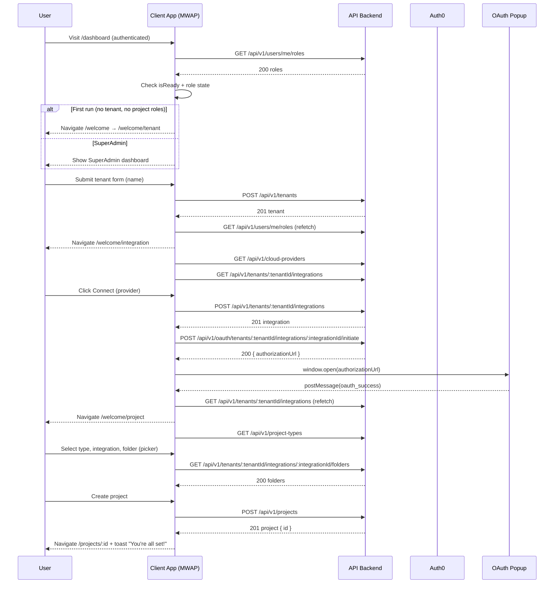

## Overview

### Problem Statement
Newly authenticated users without an existing tenant or project roles have no guided path to become productive. We need a gated, deterministic first-run wizard that creates a tenant, connects a cloud integration via OAuth/PKCE, and creates the user’s first project.

### Goals
- Provide a zero-dead-end onboarding that always results in a usable project.
- Gate routing on `isReady` and actual role state to avoid flicker or incorrect redirects.
- Use existing API surface and OAuth/PKCE patterns (proxy + backend-driven OAuth).
- Keep logic thin and feature-first (hooks + pages), reusing shared utilities and API client.

### Out of Scope
- SuperAdmin catalogs and administration features beyond routing to the SuperAdmin dashboard.
- Advanced tenant settings, member management, and multi-tenant switching.
- Provider management, OAuth provider configuration, and backend callback handling (backend-owned).

### Success Metrics
- A1–A6 acceptance criteria met in E2E tests.
- Time-to-first-project (median) ≤ 90 seconds on a healthy network.
- OAuth completion success rate ≥ 95% excluding provider-side outages.
- No routing flicker; zero navigation to incorrect areas during wizard.

### Actors, Roles, and Permissions Matrix
- SuperAdmin: Has system-wide capabilities and sees the SuperAdmin dashboard.
- TenantOwner: Owns a single tenant (backend enforced). Can create integrations and projects in that tenant.
- ProjectMember: May have project-scoped roles; not applicable during first-run until after project creation.

Permissions (summary):
- Tenant: create (TenantOwner only, one per user enforced by backend), read (owner), update (owner), delete (owner; not used here).
- Integration: create/initiate OAuth (TenantOwner), read/list (TenantOwner), delete (TenantOwner).
- Project: create (TenantOwner), read/list (members), update/delete (owners; not used here).

References: See DOCUMENTATION_INDEX and linked docs, notably Security (Auth0 PKCE), Frontend patterns, and API reference.

## User Flow Summary

- Step 0 (Gate & Redirect): On `/dashboard`, after `isReady`, fetch roles `GET /api/v1/users/me/roles`. If `isSuperAdmin` → SuperAdmin dashboard. Else if no tenant and no project roles → redirect to `/welcome`.
- Step 1 (Create Tenant): At `/welcome/tenant`, submit tenant name → `POST /api/v1/tenants`; on 201, refetch roles; go to `/welcome/integration`. On 409, show friendly message and refetch roles.
- Step 2 (Connect Integration): At `/welcome/integration`, list providers and existing integrations. On Connect: `POST /api/v1/tenants/:tenantId/integrations` → `POST /api/v1/oauth/tenants/:tenantId/integrations/:integrationId/initiate` → open popup → wait for `postMessage` (`oauth_success`/`oauth_error`). On success, refetch integrations and continue to `/welcome/project`.
- Step 3 (Create Project): At `/welcome/project`, load project types; show provider-agnostic folder picker via `GET .../folders`; create project `POST /api/v1/projects` with immutable triplet (projectTypeId, cloudIntegrationId, folderpath). On success, navigate to `/projects/:id` with success toast.
- Step 4 (Done & Fallbacks): Handle OAuth popup closure, folder picker failure (manual entry fallback), and refetch roles after each step.



## Functional Requirements

Legend: Steps S0–S4 map to flow steps described above.

### Routing & Gates
- FR-1: DashboardGate must gate routing on `isReady` and roles (S0).
  - Rationale: Avoid flicker and incorrect redirects.
  - Dependencies: Auth context, `GET /users/me/roles`.
  - Trace: S0.
- FR-2: First-run detection redirects to `/welcome` when `!isTenantOwner` and no `projectRoles` (S0).
  - Rationale: Begin wizard for net-new users.
  - Dependencies: FR-1.
  - Trace: S0.
- FR-3: Welcome routes must be protected by `ProtectedRoute` and gated per prerequisite with `WelcomeRouteGuard` (S1–S3).
  - Rationale: Prevent skipping steps or invalid access.
  - Dependencies: Auth roles, integrations list.
  - Trace: S1–S3.

### Tenant Creation
- FR-4: Display tenant form with zod schema `name: string(3–50)` and create tenant via `POST /tenants` (S1).
  - Rationale: Minimal tenant creation UX.
  - Dependencies: API client; Zod; React Hook Form.
  - Trace: S1.
- FR-5: On 201, refetch roles and route to `/welcome/integration` (S1).
  - Rationale: Keep router decisions in sync.
  - Dependencies: React Query; Auth roles cache.
  - Trace: S1.
- FR-6: On 409 (tenant exists), show friendly message and refetch roles (S1).
  - Rationale: Backend enforces one-tenant rule; UX should gracefully continue.
  - Dependencies: API error handling.
  - Trace: S1.

### Connect Integration & OAuth
- FR-7: List providers via `GET /cloud-providers` and existing integrations via `GET /tenants/:tenantId/integrations` (S2).
  - Rationale: Choose a provider and show current state.
  - Dependencies: Tenant id from roles.
  - Trace: S2.
- FR-8: On Connect, create placeholder integration via `POST /tenants/:tenantId/integrations` (S2).
  - Rationale: Backend-driven OAuth requires an integration entity.
  - Dependencies: Provider id; tenant id.
  - Trace: S2.
- FR-9: Initiate OAuth via `POST /oauth/tenants/:tenantId/integrations/:integrationId/initiate`, open popup, handle `postMessage` success/error, refetch integrations on success (S2).
  - Rationale: Standardized OAuth/PKCE popup flow.
  - Dependencies: OAuth popup hook; PKCE handled by backend.
  - Trace: S2.
- FR-10: On OAuth success, navigate to `/welcome/project` (S2).
  - Rationale: Advance wizard.
  - Dependencies: FR-9.
  - Trace: S2.

### Project Creation
- FR-11: Load project types and require an existing healthy integration (S3).
  - Rationale: Ensure valid project placement.
  - Dependencies: `GET /project-types`; integrations; optional health check.
  - Trace: S3.
- FR-12: Folder picker must use provider-agnostic folders API with path or folderId and pagination cursor (S3).
  - Rationale: Unified exploration across providers.
  - Dependencies: `GET /tenants/:tenantId/integrations/:integrationId/folders`.
  - Trace: S3.
- FR-13: Create project via `POST /projects` with immutable `projectTypeId`, `cloudIntegrationId`, and `folderpath`; redirect to `/projects/:id` with success toast (S3).
  - Rationale: Establish first project with enforced invariants.
  - Dependencies: API client; router; notifications.
  - Trace: S3.

### Done State & Fallbacks
- FR-14: If OAuth popup closes prematurely or returns error, stay on `/welcome/integration` with retry CTA (S4).
  - Rationale: Resilient OAuth UX.
  - Dependencies: OAuth popup hook; error handling.
  - Trace: S4.
- FR-15: If folder listing fails, allow manual `folderpath` entry with validation and informative tooltip (S4).
  - Rationale: Provider limitations/permissions variability.
  - Dependencies: Form validation.
  - Trace: S4.
- FR-16: After each successful step, refetch roles to keep routing honest (S1–S3).
  - Rationale: Single source of truth for gates.
  - Dependencies: React Query; roles cache.
  - Trace: S1–S3.

## Acceptance Criteria (Gherkin)

### FR-1/FR-2/FR-3 Routing & Gates
```
Scenario: First-run user is redirected to welcome without flicker
  Given I am authenticated and have no tenant and no project roles
  And the app is not yet ready
  When the app finishes loading and fetches /users/me/roles
  Then I see a loading spinner until isReady is true
  And I am redirected to /welcome

Scenario: SuperAdmin sees SuperAdmin dashboard
  Given I am authenticated and isSuperAdmin is true
  When /users/me/roles resolves
  Then I remain on the SuperAdmin dashboard

Scenario: Welcome steps are gated by prerequisites
  Given I have not created a tenant
  When I try to access /welcome/integration
  Then I am redirected to /welcome/tenant
```

### FR-4/FR-5/FR-6 Tenant Creation
```
Scenario: Tenant created successfully
  Given I am on /welcome/tenant
  When I submit a valid name between 3 and 50 characters
  Then the app POSTs /tenants and receives 201
  And roles are refetched
  And I am navigated to /welcome/integration

Scenario: Tenant already exists (409)
  Given I am on /welcome/tenant and already have a tenant server-side
  When I submit the form
  Then I see a friendly message
  And the app refetches roles
  And I proceed to /welcome/integration if tenant now present
```

### FR-7/FR-8/FR-9/FR-10 Connect Integration & OAuth
```
Scenario: Connect provider via OAuth
  Given providers and integrations are loaded
  When I click Connect for a provider
  Then the app POSTs /tenants/:tenantId/integrations and receives 201
  And POSTs /oauth/tenants/:tenantId/integrations/:integrationId/initiate
  And opens a popup to authorizationUrl
  And upon oauth_success postMessage, integrations are refetched
  And I am navigated to /welcome/project

Scenario: OAuth popup closed prematurely
  Given the OAuth popup was opened
  When I close it before completion
  Then I remain on /welcome/integration with a retry CTA
```

### FR-11/FR-12/FR-13 Project Creation
```
Scenario: Create project with folder picker
  Given at least one healthy integration exists
  And project types are loaded
  When I select a type, integration, and a folder via the picker
  And I submit the form
  Then the app POSTs /projects and receives 201 with { id }
  And I am navigated to /projects/:id
  And I see a success toast "You're all set!"

Scenario: Folder listing fails with provider limitations
  Given I am on /welcome/project
  When folders API returns an error
  Then I can manually enter folderpath with validation and an info tooltip
```

### FR-14/FR-15/FR-16 Done & Fallbacks
```
Scenario: Roles are refetched after each successful step
  Given I complete tenant creation
  When the request returns 201
  Then the app refetches /users/me/roles
  And routing respects the updated roles state
```

## Non-Functional Requirements

- Performance: Role gating decision within 250 ms of roles response; folder browsing interactions < 300 ms p95 (excluding network latency). Time-to-first-project median ≤ 90 s.
- Availability: Wizard usable with backend availability SLO; OAuth resilience includes retry and idempotency at the integration creation step.
- Security: Auth0 PKCE; all API calls via shared API client with auth headers; no token exposure; route protection via `ProtectedRoute` and RBAC. HTTPS-only endpoints via Vite proxy.
- Privacy/Compliance: No PII beyond tenant name stored via frontend; respect provider scopes per backend.
- i18n/a11y: Copy is neutral and localizable; interactive controls keyboard-accessible; color contrast meets WCAG AA.
- Observability: Log key wizard transitions (step start/success/failure), OAuth outcomes, and API error codes; emit client metrics for conversion.
- Scalability: React Query caches roles and lists; no client-side bottlenecks; folder pagination supports cursors.
- Maintainability: Hooks for data and side-effects; pages for UI; Zod schemas colocated with forms; explicit types; centralized notifications.
- Cost: Minimize redundant refetches; rely on cache invalidation on mutation.

## Data & API Contracts

### Domain Entities (TypeScript-style, indicative)
```ts
type UserRoles = {
  isSuperAdmin: boolean;
  isTenantOwner: boolean;
  tenantId?: string;
  projectRoles: Array<{ projectId: string; role: 'OWNER' | 'ADMIN' | 'EDITOR' | 'VIEWER' }>;
};

type Tenant = {
  id: string;
  name: string; // 3-50 chars
  ownerId: string; // Auth0 sub
  createdAt: string;
};

type CloudProvider = {
  id: string;
  name: string;
  code: string; // e.g., 'gdrive', 'dropbox'
  iconUrl?: string;
  capabilities?: string[];
};

type Integration = {
  id: string;
  tenantId: string;
  providerId: string;
  status: 'PENDING' | 'AUTHORIZED' | 'ERROR' | 'DISCONNECTED';
  displayName?: string;
  createdAt: string;
  updatedAt: string;
};

type OAuthInitiateResponse = {
  authorizationUrl: string;
};

type ProjectType = {
  id: string;
  name: string;
  description?: string;
};

type Project = {
  id: string;
  tenantId: string;
  name: string; // 1-100
  projectTypeId: string; // immutable
  cloudIntegrationId: string; // immutable
  folderpath: string; // immutable; provider-normalized path
  createdAt: string;
};

type Folder = {
  id: string;
  name: string;
  path: string; // display path, URL-safe
  isContainer: boolean; // folder only (no files)
};
```

### Error Model
```ts
type ApiError = {
  status: number;
  code: string; // stable machine code
  message: string; // user-friendly message allowed for display
  details?: unknown;
};
```

### API Surface (subset used in wizard)

- GET `/api/v1/users/me/roles`
  - Purpose: Determine first-run and RBAC.
  - Response: `UserRoles`.

- POST `/api/v1/tenants`
  - Purpose: Create tenant (one per user enforced).
  - Request: `{ name: string }` (3–50 chars).
  - 201 Response: `Tenant`.
  - 409 Response: `ApiError` (tenant already exists).

- GET `/api/v1/cloud-providers`
  - Purpose: List supported providers.
  - 200 Response: `CloudProvider[]`.

- GET `/api/v1/tenants/{tenantId}/integrations`
  - Purpose: List integrations for tenant.
  - 200 Response: `Integration[]`.

- POST `/api/v1/tenants/{tenantId}/integrations`
  - Purpose: Create placeholder integration before OAuth.
  - Request: `{ providerId: string }`.
  - 201 Response: `Integration`.

- POST `/api/v1/oauth/tenants/{tenantId}/integrations/{integrationId}/initiate`
  - Purpose: Start OAuth (backend-driven, PKCE supported).
  - 200 Response: `OAuthInitiateResponse`.

- GET `/api/v1/project-types`
  - Purpose: List available project types.
  - 200 Response: `ProjectType[]`.

- GET `/api/v1/tenants/{tenantId}/integrations/{integrationId}/folders`
  - Purpose: List folders for provider-agnostic picker.
  - Query: `path?: string`, `folderId?: string`, `cursor?: string` (pagination).
  - 200 Response: `{ items: Folder[]; nextCursor?: string }`.

- POST `/api/v1/projects`
  - Purpose: Create project with immutable triplet.
  - Request: `{ name: string; projectTypeId: string; cloudIntegrationId: string; folderpath: string }`.
  - 201 Response: `Project`.

## UX Notes

- Loading states: Show `<LoadingSpinner />` while `isReady` or data queries are loading.
- Empty states: Clear copy explaining next action (e.g., no integrations yet → Connect CTA).
- Errors: Use shared notifications with generic messages; precise logs client-side; OAuth errors stay in step with retry.
- Copy/tone: Friendly, concise, imperative. E.g., “Let’s create your workspace (tenant).”
- Accessibility: Keyboard accessible forms/buttons; focus management on step transitions; labels/aria for inputs; color contrast AA.
- Localization: All texts wrapped for i18n; no concatenated sentences.

## Risks, Assumptions, Open Questions

### Risks
1. OAuth popup blocked by browser (Impact: Medium, Probability: Medium) → Mitigation: Open on direct user gesture; show fallback link.
2. Provider-specific folder API inconsistencies (M, M) → Mitigation: Manual folderpath entry fallback with validation.
3. Race conditions around roles refetch (L, M) → Mitigation: `isReady` gate; React Query invalidate/await.
4. Partial completion leaves orphan integration in PENDING (L, M) → Mitigation: Backend cleanup job or reuse on retry.

### Assumptions
- Backend enforces one tenant per user and returns 409 when violated.
- Backend-driven OAuth returns a single `authorizationUrl` and postMessage contract is already standardized.
- Health endpoint for integrations exists or is optional for gating project creation.
- API client handles auth headers and error transformation centrally.

### Open Questions
1. Should we block project creation if integration health is degraded, or only warn?
2. Do we support multiple project types by default, and are they tenant-scoped?
3. What exact `UserRoles` shape is authoritative (fields beyond those listed)?

## Traceability Matrix

| Flow Step | FRs | AC Scenarios | API/Data |
|---|---|---|---|
| S0 Gate & Redirect | FR-1, FR-2, FR-3 | Routing without flicker; SuperAdmin dashboard | GET /users/me/roles |
| S1 Create Tenant | FR-4, FR-5, FR-6 | Tenant created; 409 flow | POST /tenants; roles refetch; Tenant |
| S2 Connect Integration | FR-7, FR-8, FR-9, FR-10 | OAuth connect; popup closed | GET/POST integrations; POST oauth initiate; Integration; OAuthInitiateResponse |
| S3 Create Project | FR-11, FR-12, FR-13 | Create project; folder failure | GET project-types; GET folders; POST projects; Project |
| S4 Done & Fallbacks | FR-14, FR-15, FR-16 | Retry OAuth; manual folderpath; roles refetch | Integrations list; folders; roles |

## Release & Validation Plan

- Milestones:
  1. Routing & gates complete (FR-1..3) behind feature flag `firstRunWizard`.
  2. Tenant creation flow (FR-4..6) with role refetch.
  3. Integration connect & OAuth (FR-7..10) with popup.
  4. Project creation (FR-11..13) with folder picker and fallbacks.
  5. Polish, observability, and E2E coverage (FR-14..16).

- Feature Flags / Kill Switches: `firstRunWizard` guards `/welcome` entry and DashboardGate redirect behavior.

- Migration/Backfill: None (user-scoped wizard). Ensure legacy users unaffected.

- Test Strategy:
  - Unit: hooks (roles gating, folder picker pagination), form schemas, API hooks.
  - Integration: OAuth popup hook with mocked postMessage; roles refetch after mutations.
  - E2E: First-run happy path; 409 tenant; OAuth cancel; folder listing error; manual folderpath; SuperAdmin route.
  - Perf: Measure TTFP (time-to-first-project) and step latencies.
  - Security: Verify route protection and no token exposure; CSP for popup.


