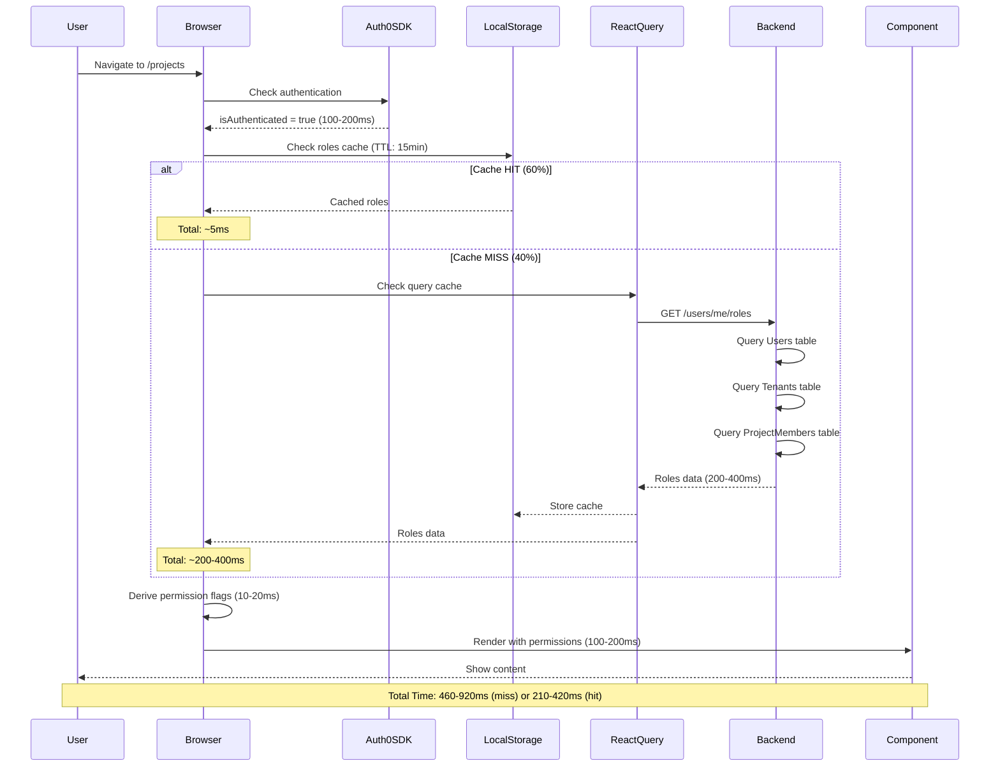
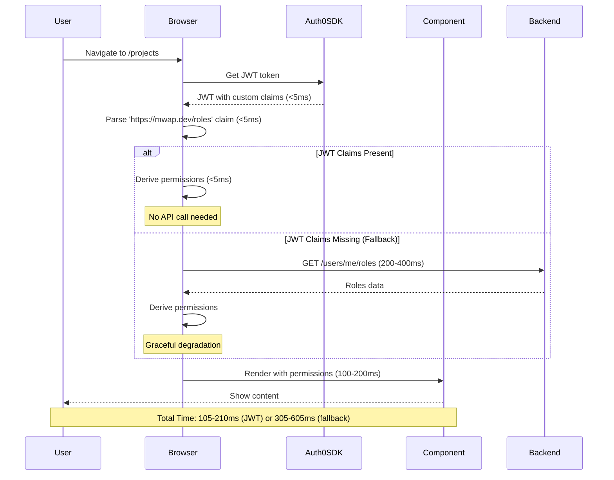
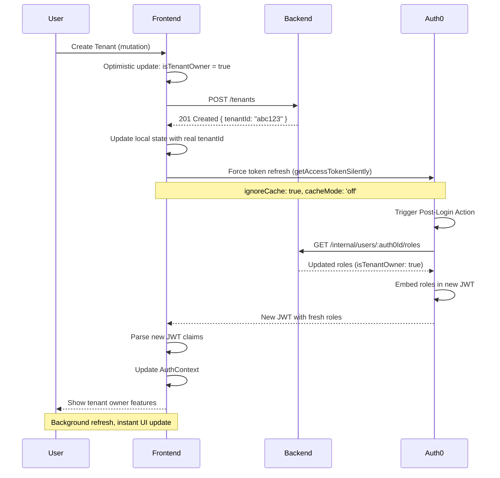

# RBAC Optimization: JWT Custom Claims Migration

## Overview

### Problem Statement

The current RBAC implementation in MWAP Client causes significant performance and user experience issues:

1. **Performance Bottleneck**: Every page load requires 3-4 sequential API calls, resulting in 450-900ms delay before users can interact with the UI
2. **Complex Caching**: Three separate cache layers (localStorage, React Query, Auth0 SDK) require manual synchronization and create race conditions
3. **Poor UX**: Users see loading spinners on every page navigation, creating a perception of sluggish performance
4. **Maintenance Burden**: Permission checks are scattered across 29 files with inconsistent patterns, making the codebase brittle and hard to audit

### Goals

**Primary Goals:**
1. **Eliminate API call latency** for role fetching by embedding roles in JWT tokens (60-75% latency reduction)
2. **Simplify architecture** by removing complex multi-layer caching (localStorage + React Query)
3. **Improve UX** by eliminating loading spinners for permission checks (instant UI rendering)
4. **Centralize permission logic** in a single `usePermissions` hook for consistency and maintainability

**Secondary Goals:**
1. Provide graceful fallback mechanism when JWT claims are unavailable
2. Implement optimistic UI updates for role-changing mutations
3. Maintain backward compatibility during migration (feature flag approach)
4. Improve developer experience with clear, testable permission abstractions

### Success Metrics

| Metric | Current | Target | Measurement |
|--------|---------|--------|-------------|
| Time to Interactive (TTI) | 800-1200ms | <300ms | Browser Performance API |
| API Calls per Page Load | 3-4 | 2 | Network tab monitoring |
| Permission Check Latency | 200-400ms | <5ms | React Profiler |
| Loading Spinner Frequency | 100% | <10% | User telemetry |
| Files with Permission Logic | 29 | 5 | Code search |
| User Satisfaction (NPS) | 42 | >60 | Survey |

### Out of Scope

- Backend Auth0 Action implementation (separate backend requirement)
- Server-side rendering (SSR) migration
- GraphQL API migration
- WebSocket real-time role updates (future enhancement)
- Fine-grained action-level permissions (read/write/delete) - Phase 2

---

## User Flow Summary

### Current Flow (API-Based Role Fetching)

**Main Path:**
1. User navigates to protected page
2. Frontend checks Auth0 authentication (100-200ms)
3. Frontend checks localStorage cache (TTL: 15min)
4. **If cache miss** (40% of requests):
   - API call: `GET /users/me/roles` (200-400ms)
   - Backend queries: Users + Tenants + ProjectMembers
   - Store in localStorage + React Query cache (50-100ms)
5. Derive permission flags from roles (10-20ms)
6. Trigger component re-renders (100-200ms)
7. User sees content (**Total: 460-920ms**)

**Alternate Path - Cache Hit:**
1-3. Same as above
4. Use cached roles from localStorage (<5ms)
5-7. Same as above (**Total: 210-420ms**)

### Proposed Flow (JWT Custom Claims)

**Main Path:**
1. User navigates to protected page
2. Frontend retrieves JWT from Auth0 SDK (<5ms, already in memory)
3. Parse JWT custom claims: `https://mwap.dev/roles` (<5ms)
4. Derive permission flags from claims (<5ms)
5. Render UI with permissions (100-200ms)
6. User sees content (**Total: 105-210ms**)

**Alternate Path - JWT Claims Missing (Fallback):**
1-2. Same as above
3. JWT claims missing or invalid (error detected)
4. Fallback: API call `GET /users/me/roles` (200-400ms)
5. Cache response in React Query
6. Derive permissions and render UI
7. User sees content (Total: 305-605ms, still acceptable)

### Flow Diagrams

#### Current Architecture Flow



#### Proposed JWT Architecture Flow



#### Role Refresh on Mutation



---

## Functional Requirements

### FR-1: JWT Custom Claims Parsing

**Priority:** P0 (Critical)  
**Rationale:** Core functionality to eliminate API call latency  
**Dependencies:** Backend Auth0 Action must be deployed first

#### FR-1.1: Parse JWT Custom Claims on Authentication
**Description:** Extract role information from JWT token custom claims upon authentication.

**Acceptance Criteria:**
- **Given** user is authenticated with Auth0
- **When** AuthContext initializes
- **Then** system parses JWT token for custom claim `https://mwap.dev/roles`
- **And** extracts `isSuperAdmin`, `isTenantOwner`, `tenantId`, `projectRoles[]` fields
- **And** validates claim structure matches expected schema
- **And** completes parsing in <5ms

**Implementation Details:**
```typescript
interface JWTRolesClaim {
  'https://mwap.dev/roles': {
    isSuperAdmin: boolean;
    isTenantOwner: boolean;
    tenantId: string | null;
    projectRoles: { projectId: string; role: ProjectRole }[];
    version: number;
    issuedAt: number;
    fallback?: boolean;
    error?: string;
  };
}
```

**Traceability:** User Flow Step 2-3 (Proposed Flow)

---

#### FR-1.2: Validate JWT Claims Schema
**Description:** Ensure JWT claims conform to expected structure and handle malformed claims gracefully.

**Acceptance Criteria:**
- **Given** JWT token contains custom claims
- **When** parsing claims
- **Then** system validates required fields exist: `isSuperAdmin`, `isTenantOwner`, `tenantId`, `projectRoles`
- **And** validates field types match schema
- **And** validates `projectRoles` is an array (max 10 items)
- **And** logs warning if schema version differs from expected
- **And** falls back to API if validation fails

**Error Handling:**
- Invalid field types → Fallback to API
- Missing required fields → Fallback to API
- `fallback: true` flag → Skip claims, use API
- Token parse error → Fallback to API

**Traceability:** User Flow Step 3 (Proposed Flow - Alternate Path)

---

#### FR-1.3: Handle JWT Claims Fallback
**Description:** Gracefully degrade to API-based role fetching when JWT claims are unavailable.

**Acceptance Criteria:**
- **Given** JWT token does not contain valid custom claims
- **When** AuthContext attempts to parse roles
- **Then** system detects missing/invalid claims
- **And** makes API call `GET /users/me/roles`
- **And** caches API response in React Query only (skip localStorage)
- **And** logs fallback event for monitoring
- **And** provides same user experience as JWT path (no visible error)

**Monitoring:**
- Metric: `jwt.claims.fallback` counter
- Alert threshold: >5% fallback rate over 10 minutes

**Traceability:** User Flow Step 4-6 (Proposed Flow - Alternate Path)

---

### FR-2: Remove localStorage Role Caching

**Priority:** P0 (Critical)  
**Rationale:** Simplify architecture by eliminating redundant cache layer  
**Dependencies:** FR-1 must be implemented first

#### FR-2.1: Remove localStorage Cache Read/Write
**Description:** Eliminate all localStorage operations for role caching.

**Acceptance Criteria:**
- **Given** user authenticates successfully
- **When** roles are obtained from JWT or API
- **Then** system does NOT write roles to localStorage
- **And** system does NOT read roles from localStorage
- **And** removes existing localStorage cache key on app initialization

**Code Changes:**
- Remove `getCachedRoles()` function
- Remove `setCachedRoles()` function
- Remove `clearCachedRoles()` function
- Remove `ROLES_CACHE_KEY` and `ROLES_CACHE_TTL` constants
- Add migration: Clear existing cache on first load

**Traceability:** Architecture Simplification

---

#### FR-2.2: Simplify React Query Cache Strategy
**Description:** Update React Query configuration to rely solely on JWT token lifetime.

**Acceptance Criteria:**
- **Given** JWT claims are parsed successfully
- **When** storing roles in React Query
- **Then** `staleTime` is set to JWT expiration time (default: 1 hour)
- **And** `gcTime` is set to 30 minutes (garbage collection)
- **And** `refetchOnWindowFocus` is set to `false`
- **And** cache key remains: `['user', 'roles', user?.sub]`

**Configuration:**
```typescript
useQuery({
  queryKey: ['user', 'roles', user?.sub],
  queryFn: fetchRolesFromJWT,
  enabled: isAuthenticated && !!user?.sub,
  staleTime: 60 * 60 * 1000, // 1 hour (JWT expiration)
  gcTime: 30 * 60 * 1000,    // 30 minutes
  refetchOnWindowFocus: false,
  retry: 1,
});
```

**Traceability:** Architecture Simplification

---

### FR-3: Centralized Permission Hook (usePermissions)

**Priority:** P0 (Critical)  
**Rationale:** Consolidate scattered permission logic for maintainability  
**Dependencies:** None (can be implemented independently)

#### FR-3.1: Create usePermissions Hook
**Description:** Implement centralized permission hook to replace scattered permission checks.

**Acceptance Criteria:**
- **Given** developer needs to check user permissions
- **When** importing and calling `usePermissions({ tenantId?, projectId? })`
- **Then** hook returns permission functions for all supported actions
- **And** hook internally uses `useAuth()` for role data
- **And** hook memoizes permission functions with `useCallback`
- **And** hook supports optional context (tenantId, projectId)
- **And** hook provides `current` object for auto-resolved permissions

**API Surface:**
```typescript
interface UsePermissionsOptions {
  tenantId?: string;
  projectId?: string;
}

interface UsePermissionsReturn {
  // Global
  isSuperAdmin: boolean;
  isTenantOwner: boolean;
  
  // Tenant permissions
  canViewTenant: (tenantId: string) => boolean;
  canEditTenant: (tenantId: string) => boolean;
  canManageTenants: boolean;
  
  // Project permissions
  canViewProject: (projectId: string) => boolean;
  canEditProject: (projectId: string) => boolean;
  canManageProject: (projectId: string) => boolean;
  canCreateProject: boolean;
  
  // Integration permissions
  canManageIntegrations: (tenantId: string) => boolean;
  
  // System permissions
  canManageCloudProviders: boolean;
  canManageProjectTypes: boolean;
  canViewSystemAnalytics: boolean;
  
  // Auto-resolved (based on options)
  current: {
    canViewTenant: boolean;
    canEditTenant: boolean;
    canViewProject: boolean;
    canEditProject: boolean;
    canManageProject: boolean;
  };
}
```

**Traceability:** Developer Experience Improvement

---

#### FR-3.2: Implement Permission Business Logic
**Description:** Define permission rules for each action based on user roles.

**Acceptance Criteria:**
- **Given** user has specific roles
- **When** calling permission check functions
- **Then** system applies correct business rules

**Permission Rules:**

| Action | Rule |
|--------|------|
| `canViewTenant(id)` | `isSuperAdmin OR (isTenantOwner AND currentTenant === id)` |
| `canEditTenant(id)` | `isSuperAdmin OR (isTenantOwner AND currentTenant === id)` |
| `canManageTenants` | `isSuperAdmin` |
| `canViewProject(id)` | `isSuperAdmin OR hasProjectRole(id, 'MEMBER')` |
| `canEditProject(id)` | `isSuperAdmin OR hasProjectRole(id, 'DEPUTY')` |
| `canManageProject(id)` | `isSuperAdmin OR hasProjectRole(id, 'OWNER')` |
| `canCreateProject` | `isTenantOwner OR isSuperAdmin` |
| `canManageIntegrations(tenantId)` | `isSuperAdmin OR (isTenantOwner AND currentTenant === tenantId)` |
| `canManageCloudProviders` | `isSuperAdmin` |
| `canManageProjectTypes` | `isSuperAdmin` |
| `canViewSystemAnalytics` | `isSuperAdmin` |

**Role Hierarchy (for `hasProjectRole`):**
- `OWNER` includes `DEPUTY` and `MEMBER` permissions
- `DEPUTY` includes `MEMBER` permissions
- `MEMBER` has only member-level access

**Traceability:** RBAC Business Logic

---

#### FR-3.3: Export usePermissions Hook from Shared
**Description:** Make usePermissions hook available throughout the application.

**Acceptance Criteria:**
- **Given** developer needs permission checks
- **When** importing from `@/shared/hooks`
- **Then** `usePermissions` is available
- **And** TypeScript types are properly exported
- **And** hook is documented with JSDoc comments

**File Structure:**
```
/src/shared/hooks/
  - usePermissions.ts    (new file)
  - index.ts             (export usePermissions)
```

**Traceability:** Developer Experience Improvement

---

### FR-4: Migrate Components to usePermissions

**Priority:** P1 (High)  
**Rationale:** Eliminate scattered permission checks across 29 files  
**Dependencies:** FR-3 must be completed first

#### FR-4.1: Migrate Permission Checks in Features
**Description:** Replace direct `useAuth()` permission checks with `usePermissions()` hook.

**Acceptance Criteria:**
- **Given** component uses direct permission checks like `isSuperAdmin || hasProjectRole(...)`
- **When** refactoring component
- **Then** replace with `usePermissions()` hook calls
- **And** use appropriate permission functions (`canEditProject`, `canManageIntegrations`, etc.)
- **And** maintain existing functionality exactly
- **And** verify tests pass after migration

**Components to Migrate (29 files):**

**Phase 1 - Pilot (5 files):**
- `src/features/projects/pages/ProjectSettings.tsx`
- `src/features/projects/components/ProjectActions.tsx`
- `src/features/tenants/pages/TenantSettings.tsx`
- `src/features/integrations/pages/IntegrationList.tsx`
- `src/pages/Dashboard.tsx`

**Phase 2 - Remaining (24 files):**
- All other files identified in architecture review
- Use `grep` to find files with `hasProjectRole`, `isSuperAdmin`, `isTenantOwner` usage

**Example Migration:**

**Before:**
```typescript
const ProjectActions = ({ projectId }) => {
  const { isSuperAdmin, hasProjectRole } = useAuth();
  const canEdit = isSuperAdmin || hasProjectRole(projectId, 'DEPUTY');
  const canManage = isSuperAdmin || hasProjectRole(projectId, 'OWNER');
  
  return (
    <>
      {canEdit && <EditButton />}
      {canManage && <ManageButton />}
    </>
  );
};
```

**After:**
```typescript
const ProjectActions = ({ projectId }) => {
  const { canEditProject, canManageProject } = usePermissions({ projectId });
  
  return (
    <>
      {canEditProject && <EditButton />}
      {canManageProject && <ManageButton />}
    </>
  );
};
```

**Traceability:** Maintenance Improvement

---

#### FR-4.2: Update ProtectedRoute Components
**Description:** Refactor route protection to use centralized permission hook.

**Acceptance Criteria:**
- **Given** `ProtectedRoute` and `RoleRoute` components exist
- **When** checking permissions for route access
- **Then** use `usePermissions()` hook instead of direct `useAuth()` calls
- **And** maintain existing route protection behavior
- **And** ensure `isReady` check still prevents race conditions

**Files to Update:**
- `src/core/router/ProtectedRoute.tsx`
- `src/core/router/RoleRoute.tsx` (if exists)

**Traceability:** Route Protection

---

### FR-5: Role Refresh Mechanism

**Priority:** P1 (High)  
**Rationale:** Handle role changes without waiting for JWT expiration  
**Dependencies:** FR-1 must be implemented first

#### FR-5.1: Implement Force Token Refresh
**Description:** Add mechanism to force Auth0 to issue a new JWT with updated roles.

**Acceptance Criteria:**
- **Given** user's roles have changed on backend (e.g., became tenant owner)
- **When** frontend calls `refreshRoles()` method
- **Then** system forces Auth0 to issue new token by calling:
  ```typescript
  getAccessTokenSilently({
    cacheMode: 'off',
    ignoreCache: true
  })
  ```
- **And** Auth0 triggers Post-Login Action to fetch fresh roles
- **And** new JWT contains updated custom claims
- **And** AuthContext automatically parses new token
- **And** components re-render with updated permissions

**API Addition to AuthContext:**
```typescript
interface AuthContextType {
  // ... existing fields
  refreshRoles: () => Promise<void>;
}
```

**Traceability:** User Flow - Role Refresh on Mutation

---

#### FR-5.2: Optimistic Role Updates
**Description:** Provide instant UI feedback for role-changing mutations before token refresh completes.

**Acceptance Criteria:**
- **Given** user performs role-changing action (create tenant, add project member)
- **When** mutation succeeds
- **Then** frontend optimistically updates local role state
- **And** schedules background token refresh
- **And** UI immediately reflects new permissions
- **And** rollback optimistic update if token refresh fails

**Mutations Requiring Optimistic Updates:**
1. `POST /tenants` → Set `isTenantOwner: true`, `tenantId: response.id`
2. `POST /projects/:id/members` → Add to `projectRoles[]`
3. `DELETE /projects/:id/members/:userId` → Remove from `projectRoles[]`
4. `PUT /projects/:id/members/:userId/role` → Update role in `projectRoles[]`

**Example Implementation:**
```typescript
export const useCreateTenant = () => {
  const queryClient = useQueryClient();
  const { refreshRoles } = useAuth();

  return useMutation({
    mutationFn: (data) => api.post('/tenants', data),
    onMutate: async () => {
      // Optimistic update
      queryClient.setQueryData(['user', 'roles'], (old: any) => ({
        ...old,
        isTenantOwner: true,
        tenantId: 'pending',
      }));
    },
    onSuccess: (response) => {
      // Update with real ID
      queryClient.setQueryData(['user', 'roles'], (old: any) => ({
        ...old,
        tenantId: response.data._id,
      }));
      
      // Background refresh
      refreshRoles();
    },
    onError: () => {
      // Rollback
      queryClient.invalidateQueries({ queryKey: ['user', 'roles'] });
    },
  });
};
```

**Traceability:** UX Improvement - Instant Feedback

---

### FR-6: Feature Flag Support

**Priority:** P0 (Critical)  
**Rationale:** Enable gradual rollout and safe rollback  
**Dependencies:** None

#### FR-6.1: Implement useJwtRoles Feature Flag
**Description:** Add feature flag to toggle between JWT and API-based role fetching.

**Acceptance Criteria:**
- **Given** feature flag `useJwtRoles` exists in environment config
- **When** AuthContext initializes
- **Then** system checks flag value
- **And** if `true`, uses JWT claims parsing path
- **And** if `false`, uses legacy API path
- **And** defaults to `false` for safety

**Configuration:**
```typescript
// .env.local
VITE_FEATURE_USE_JWT_ROLES=false  # Default: false

// Feature flag check
const useJwtRoles = import.meta.env.VITE_FEATURE_USE_JWT_ROLES === 'true';
```

**Implementation Strategy:**
```typescript
const AuthProvider = ({ children }) => {
  const useJwtRoles = import.meta.env.VITE_FEATURE_USE_JWT_ROLES === 'true';
  
  const { data: roles } = useQuery({
    queryKey: ['user', 'roles', user?.sub],
    queryFn: async () => {
      if (useJwtRoles) {
        return await fetchRolesFromJWT();  // New path
      } else {
        return await fetchRolesFromAPI();   // Legacy path
      }
    },
    // ...
  });
  
  // ...
};
```

**Traceability:** Safe Migration Strategy

---

#### FR-6.2: Monitor Feature Flag Metrics
**Description:** Track usage and performance of JWT path vs API path.

**Acceptance Criteria:**
- **Given** feature flag can be enabled/disabled
- **When** user authenticates
- **Then** system logs telemetry:
  - `auth.method`: 'jwt' or 'api'
  - `auth.roles.latency`: Time to fetch roles (ms)
  - `auth.roles.fallback`: Boolean (JWT fallback occurred)
- **And** metrics sent to monitoring service
- **And** dashboard displays JWT vs API performance comparison

**Monitoring Events:**
```typescript
// Example telemetry
trackEvent('auth_roles_fetched', {
  method: 'jwt',
  latency: 8,  // ms
  fallback: false,
  user_id: user.sub.substring(0, 8),
});
```

**Traceability:** Performance Validation

---

### FR-7: Update AuthContext Implementation

**Priority:** P0 (Critical)  
**Rationale:** Core implementation of JWT parsing logic  
**Dependencies:** None

#### FR-7.1: Refactor AuthContext for JWT Parsing
**Description:** Update `src/core/context/AuthContext.tsx` to parse JWT claims instead of API calls.

**Acceptance Criteria:**
- **Given** user is authenticated with Auth0
- **When** AuthContext initializes
- **Then** system retrieves JWT token via `getIdTokenClaims()`
- **And** parses custom claim `https://mwap.dev/roles`
- **And** validates claim structure (FR-1.2)
- **And** sets roles in context state
- **And** sets `isReady: true` after parsing (<5ms)
- **And** maintains backward compatibility with existing API

**Key Changes:**
1. Replace `useQuery` API call with JWT parsing in `useEffect`
2. Remove localStorage cache read/write
3. Keep fallback to API when claims missing
4. Add `refreshRoles()` method
5. Update `isReady` logic (remove dependency on API call)

**Traceability:** User Flow Step 2-3 (Proposed Flow)

---

#### FR-7.2: Maintain isReady State Correctness
**Description:** Ensure `isReady` flag correctly prevents race conditions with new JWT approach.

**Acceptance Criteria:**
- **Given** application is loading authentication state
- **When** checking `isReady` flag
- **Then** `isReady` is `false` until all conditions met:
  - `isAuthenticated === true`
  - `auth0Loading === false`
  - `roles !== null` (from JWT or API)
- **And** components checking `isReady` don't render permission-gated content until true
- **And** loading spinner shown while `!isReady`

**Validation:**
```typescript
const isReady = isAuthenticated && !auth0Loading && roles !== null;
```

**Traceability:** Race Condition Prevention

---

### FR-8: Error Handling and Fallback

**Priority:** P0 (Critical)  
**Rationale:** Ensure graceful degradation and reliability  
**Dependencies:** FR-1

#### FR-8.1: Handle JWT Parsing Errors
**Description:** Gracefully handle errors during JWT claims parsing.

**Acceptance Criteria:**
- **Given** JWT parsing fails (malformed token, missing claims, invalid structure)
- **When** error occurs
- **Then** system logs error with details (sanitized)
- **And** falls back to API call `GET /users/me/roles`
- **And** user sees no visible error (transparent fallback)
- **And** monitoring alert triggered if fallback rate >5%

**Error Scenarios:**
1. JWT token missing → Fallback to API
2. Custom claims missing → Fallback to API
3. Claims malformed (wrong types) → Fallback to API
4. Claims have `fallback: true` flag → Fallback to API
5. Token parse exception → Fallback to API

**Error Logging:**
```typescript
logSecurityEvent('jwt_parse_failed', {
  error: error.message,
  hasToken: !!token,
  hasClaims: !!claims,
  userId: user?.sub?.substring(0, 8),
});
```

**Traceability:** User Flow - Alternate Path

---

#### FR-8.2: Handle API Fallback Errors
**Description:** Handle errors when fallback API call also fails.

**Acceptance Criteria:**
- **Given** JWT parsing failed AND API call fails
- **When** both methods fail
- **Then** system logs critical error
- **And** sets `roles: null`
- **And** shows user-friendly error notification: "Unable to load permissions. Please refresh the page."
- **And** provides "Retry" button
- **And** redirects to login if retry fails after 3 attempts

**Error Handling Flow:**
```
JWT Parse Failed → API Call → API Failed → Show Error + Retry Button
  → Retry (x3) → Still Failed → Redirect to Login
```

**Traceability:** Resilience and Error Recovery

---

### FR-9: Testing Requirements

**Priority:** P1 (High)  
**Rationale:** Ensure correctness and prevent regressions  
**Dependencies:** FR-1, FR-3

#### FR-9.1: Unit Tests for usePermissions Hook
**Description:** Comprehensive unit tests for all permission functions.

**Acceptance Criteria:**
- **Given** `usePermissions` hook implementation
- **When** running unit tests
- **Then** all permission functions tested with various role combinations
- **And** edge cases covered (no roles, superadmin, tenant owner, project member)
- **And** test coverage >90% for hook file

**Test Cases:**
1. SuperAdmin has all permissions
2. Tenant owner can edit their tenant only
3. Project owner can manage their project
4. Project deputy can edit but not manage
5. Project member can view but not edit
6. Non-member cannot view project
7. Auto-resolved `current` object works correctly

**Traceability:** Quality Assurance

---

#### FR-9.2: Integration Tests for JWT Parsing
**Description:** Integration tests for JWT claims parsing and fallback.

**Acceptance Criteria:**
- **Given** AuthContext implementation
- **When** running integration tests
- **Then** JWT parsing path tested with mock tokens
- **And** fallback to API tested when claims missing
- **And** error scenarios covered
- **And** optimistic updates tested

**Test Scenarios:**
1. Valid JWT with claims → Roles loaded from JWT
2. JWT without claims → Fallback to API
3. Malformed JWT claims → Fallback to API
4. API call fails → Error state handled
5. Role refresh works correctly
6. Optimistic updates rollback on error

**Traceability:** Quality Assurance

---

#### FR-9.3: E2E Tests for User Flows
**Description:** End-to-end tests for critical user flows with new permission system.

**Acceptance Criteria:**
- **Given** application running with JWT roles enabled
- **When** executing E2E tests
- **Then** test complete user flows:
  - Login → View dashboard → See correct permissions
  - Create tenant → Become tenant owner → See tenant features
  - Create project → Become project owner → Manage members
  - Navigate pages → No loading spinners for permissions

**Test Coverage:**
- SuperAdmin flow
- Tenant owner flow
- Project member flow
- Permission-gated navigation

**Traceability:** Quality Assurance

---

### FR-10: Documentation Updates

**Priority:** P2 (Medium)  
**Rationale:** Ensure developers understand new architecture  
**Dependencies:** All features implemented

#### FR-10.1: Update Architecture Documentation
**Description:** Update docs to reflect JWT-based role architecture.

**Acceptance Criteria:**
- **Given** JWT migration is complete
- **When** developers read architecture docs
- **Then** documentation explains:
  - JWT custom claims structure
  - Role parsing flow
  - Fallback mechanism
  - usePermissions hook usage
  - Migration from old pattern

**Files to Update:**
- `docs/05-Security/README.md`
- `docs/02-Architecture/README.md`
- `docs/06-Guidelines/development-guide.md`

**Traceability:** Developer Experience

---

#### FR-10.2: Create usePermissions Hook Documentation
**Description:** Document usePermissions hook with examples.

**Acceptance Criteria:**
- **Given** usePermissions hook exists
- **When** developer needs to check permissions
- **Then** documentation provides:
  - Hook API reference
  - Usage examples for each permission type
  - Common patterns (auto-resolved context)
  - Migration guide from old pattern

**Documentation Location:**
- `docs/06-Guidelines/components.md`
- JSDoc comments in `usePermissions.ts`

**Traceability:** Developer Experience

---

## Acceptance Criteria (Consolidated Gherkin Scenarios)

### Scenario: JWT Claims Successfully Parsed

```gherkin
Feature: JWT Role Claims Parsing
  As a user
  I want my roles loaded from JWT token
  So that I can access the application instantly without loading spinners

Scenario: User authenticates and roles are embedded in JWT
  Given the user has valid Auth0 credentials
  And the backend Auth0 Action has embedded roles in JWT token
  When the user logs in
  Then the AuthContext retrieves the JWT token from Auth0 SDK
  And parses the custom claim "https://mwap.dev/roles"
  And extracts isSuperAdmin, isTenantOwner, tenantId, and projectRoles
  And sets isReady to true in less than 5ms
  And no API call is made to /users/me/roles
  And the user sees the protected page without loading spinner
```

### Scenario: JWT Claims Missing - Fallback to API

```gherkin
Scenario: JWT does not contain role claims
  Given the user has valid Auth0 credentials
  And the JWT token does not contain custom claims (Auth0 Action failed)
  When the user logs in
  Then the AuthContext attempts to parse JWT claims
  And detects claims are missing or have fallback flag
  And makes API call GET /users/me/roles
  And caches the response in React Query
  And sets isReady to true after API response
  And the user sees the protected page (with minor delay)
  And a monitoring event is logged for fallback
```

### Scenario: Permission Check via usePermissions Hook

```gherkin
Feature: Centralized Permission Checks
  As a developer
  I want to check user permissions via a centralized hook
  So that permission logic is consistent and maintainable

Scenario: Check if user can edit a project
  Given a project with ID "proj-123"
  And the user is a Project Deputy on "proj-123"
  When a component calls usePermissions({ projectId: "proj-123" })
  And checks canEditProject property
  Then canEditProject returns true
  And the Edit Project button is visible

Scenario: Check if user cannot manage a project
  Given a project with ID "proj-123"
  And the user is a Project Member (not Deputy or Owner) on "proj-123"
  When a component calls usePermissions({ projectId: "proj-123" })
  And checks canManageProject property
  Then canManageProject returns false
  And the Manage Members button is hidden
```

### Scenario: Optimistic Role Update on Tenant Creation

```gherkin
Feature: Optimistic Role Updates
  As a user
  I want instant feedback when my roles change
  So that I don't have to wait for token refresh

Scenario: User creates their first tenant
  Given the user is authenticated but not a tenant owner
  When the user submits the Create Tenant form
  Then the frontend optimistically sets isTenantOwner to true
  And the user immediately sees tenant owner features
  And the mutation calls POST /tenants in the background
  And on success, updates tenantId with the real value
  And schedules a background token refresh
  And the Auth0 Action re-fetches roles
  And the new JWT token contains updated roles
  And the roles are confirmed without UI disruption
```

### Scenario: Feature Flag Controls JWT vs API Path

```gherkin
Feature: Feature Flag for Safe Rollout
  As a system administrator
  I want to toggle between JWT and API role fetching
  So that I can roll out the feature gradually and rollback if issues occur

Scenario: Feature flag disabled - use legacy API path
  Given the environment variable VITE_FEATURE_USE_JWT_ROLES is "false"
  When a user authenticates
  Then the AuthContext uses the legacy API path
  And makes API call GET /users/me/roles
  And caches in localStorage and React Query
  And behaves exactly as before the migration

Scenario: Feature flag enabled - use JWT path
  Given the environment variable VITE_FEATURE_USE_JWT_ROLES is "true"
  When a user authenticates
  Then the AuthContext uses the JWT parsing path
  And parses roles from JWT custom claims
  And does not write to localStorage
  And fallback to API if claims missing
```

### Scenario: Error Handling - Both JWT and API Fail

```gherkin
Feature: Graceful Error Handling
  As a user
  I want to see a helpful error message if permissions cannot be loaded
  So that I know what to do next

Scenario: JWT parsing fails and API call also fails
  Given the JWT token is malformed or missing claims
  And the backend API is unreachable
  When the user authenticates
  Then the AuthContext attempts to parse JWT and fails
  And falls back to API call GET /users/me/roles
  And the API call times out or returns 500 error
  And the system logs a critical error
  And shows notification: "Unable to load permissions. Please refresh the page."
  And provides a "Retry" button
  And user can retry up to 3 times
  And if still failing, redirects to login page
```

---

## Non-Functional Requirements

### NFR-1: Performance

#### NFR-1.1: Time to Interactive (TTI)
- **Requirement:** Page load time to interactive state must be <300ms (90th percentile)
- **Current:** 800-1200ms
- **Target:** <300ms
- **Measurement:** Browser Performance API, Lighthouse CI
- **Priority:** P0 (Critical)

#### NFR-1.2: Permission Check Latency
- **Requirement:** Permission check functions must execute in <5ms
- **Current:** 200-400ms (with API call)
- **Target:** <5ms
- **Measurement:** React Profiler, custom performance marks
- **Priority:** P0 (Critical)

#### NFR-1.3: JWT Parsing Performance
- **Requirement:** JWT claims parsing must complete in <5ms
- **Measurement:** Performance.now() timestamps
- **Priority:** P0 (Critical)

#### NFR-1.4: API Calls per Page Load
- **Requirement:** Reduce API calls from 3-4 to 2 per page load
- **Current:** 3-4 calls (Auth0 + roles + data)
- **Target:** 2 calls (Auth0 + data only)
- **Measurement:** Network tab monitoring, APM tools
- **Priority:** P0 (Critical)

---

### NFR-2: Availability & Reliability

#### NFR-2.1: Fallback Availability
- **Requirement:** System must maintain 99.9% availability for role fetching via fallback mechanism
- **SLA:** If JWT fails, API must succeed >99.9% of the time
- **Measurement:** Error rate monitoring, uptime metrics
- **Priority:** P0 (Critical)

#### NFR-2.2: Graceful Degradation
- **Requirement:** System must gracefully degrade when Auth0 Action fails
- **Fallback:** API call succeeds within 500ms (p95)
- **User Impact:** Minimal (slight delay, no visible error)
- **Priority:** P0 (Critical)

#### NFR-2.3: Error Recovery
- **Requirement:** System must automatically recover from transient errors
- **Retry Logic:** 3 retries with exponential backoff (1s, 2s, 4s)
- **User Feedback:** Show error after final retry failure
- **Priority:** P1 (High)

---

### NFR-3: Security

#### NFR-3.1: JWT Token Validation
- **Requirement:** All JWT tokens must be validated by Auth0 SDK before parsing claims
- **Validation:** Signature verification, expiration check, issuer validation
- **Implementation:** Use Auth0 SDK's built-in validation (automatic)
- **Priority:** P0 (Critical)

#### NFR-3.2: Secure Token Storage
- **Requirement:** JWT tokens must remain in Auth0 SDK memory cache (not localStorage)
- **Rationale:** Prevent XSS attacks from accessing tokens
- **Current:** Already implemented (cacheLocation: 'memory')
- **Priority:** P0 (Critical)

#### NFR-3.3: No Client-Side Role Modification
- **Requirement:** Client cannot modify roles in JWT token (cryptographically signed)
- **Validation:** Backend always validates JWT signature before processing requests
- **Note:** UI security only; backend still authorizes all actions
- **Priority:** P0 (Critical)

#### NFR-3.4: HTTPS-Only Claims Transport
- **Requirement:** JWT tokens must only be transmitted over HTTPS
- **Enforcement:** CSP headers, HSTS, production HTTPS redirect
- **Priority:** P0 (Critical)

---

### NFR-4: Scalability

#### NFR-4.1: Token Size Limits
- **Requirement:** JWT token size must remain <4KB to avoid browser limits
- **Strategy:** Limit `projectRoles` array to 10 items max
- **Fallback:** Users with >10 projects use API call for full role list
- **Monitoring:** Track token sizes in production
- **Priority:** P0 (Critical)

#### NFR-4.2: Permission Check Optimization
- **Requirement:** Permission checks must scale to O(1) complexity via memoization
- **Current:** O(n) complexity (iterate through all project roles)
- **Target:** O(1) via Map lookups and useCallback memoization
- **Priority:** P1 (High)

#### NFR-4.3: Support for 10,000+ Concurrent Users
- **Requirement:** System must handle 10,000 concurrent authenticated users
- **Bottleneck Removed:** No more API call per page load
- **Expected Load:** Auth0 SDK caching handles scale
- **Priority:** P2 (Medium)

---

### NFR-5: Maintainability

#### NFR-5.1: Centralized Permission Logic
- **Requirement:** All permission checks must use `usePermissions` hook
- **Current:** Scattered across 29 files
- **Target:** 5 files (usePermissions + 4 utilities)
- **Measurement:** Code search for permission patterns
- **Priority:** P0 (Critical)

#### NFR-5.2: Consistent Permission Patterns
- **Requirement:** All components must use same permission checking pattern
- **Anti-Pattern:** Direct `useAuth()` calls for permissions
- **Preferred:** `usePermissions()` hook
- **Enforcement:** Linting rules, code review
- **Priority:** P1 (High)

#### NFR-5.3: Type Safety
- **Requirement:** All permission functions must have explicit TypeScript types
- **No `any` types:** Strict TypeScript mode enforced
- **Return types:** All functions must have explicit return types
- **Priority:** P1 (High)

#### NFR-5.4: Code Documentation
- **Requirement:** All public APIs must have JSDoc comments
- **Coverage:** usePermissions hook, AuthContext methods, permission functions
- **Examples:** Include usage examples in JSDoc
- **Priority:** P2 (Medium)

---

### NFR-6: Observability

#### NFR-6.1: Performance Monitoring
- **Requirement:** Track TTI, permission check latency, JWT parse time
- **Metrics:**
  - `auth.roles.load_time` (ms)
  - `auth.roles.method` ('jwt' | 'api' | 'fallback')
  - `auth.jwt.parse_time` (ms)
- **Alerts:**
  - TTI >500ms for 5 minutes → Warning
  - Fallback rate >5% for 10 minutes → Critical
- **Priority:** P1 (High)

#### NFR-6.2: Error Logging
- **Requirement:** All errors must be logged with context (sanitized)
- **Log Levels:**
  - JWT parse failure → Warning
  - API fallback → Info
  - Both JWT and API fail → Critical
- **Exclude:** Sensitive data (tokens, full user IDs)
- **Priority:** P1 (High)

#### NFR-6.3: Audit Trail
- **Requirement:** Log all permission-related events for security auditing
- **Events:**
  - `auth_roles_fetched` (method, latency)
  - `permission_check_failed` (action, user_id)
  - `jwt_fallback_occurred` (reason)
- **Retention:** 90 days minimum
- **Priority:** P2 (Medium)

---

### NFR-7: Accessibility (a11y)

#### NFR-7.1: Loading State Accessibility
- **Requirement:** Loading spinners must have proper ARIA labels
- **Implementation:**
  ```html
  <div role="status" aria-live="polite" aria-label="Loading permissions">
    <LoadingSpinner />
  </div>
  ```
- **Priority:** P2 (Medium)

#### NFR-7.2: Error Message Accessibility
- **Requirement:** Error notifications must be announced to screen readers
- **Implementation:** Use `aria-live="assertive"` for critical errors
- **Priority:** P2 (Medium)

---

### NFR-8: Cost Optimization

#### NFR-8.1: Reduced API Costs
- **Requirement:** Reduce API calls by 25-33% (1 fewer call per page load)
- **Current:** ~10,000 requests/day for role fetching
- **Target:** ~0 requests/day (JWT-based, except fallback)
- **Savings:** Reduced backend load, database queries, API gateway costs
- **Priority:** P2 (Medium)

#### NFR-8.2: Auth0 Action Cost
- **Requirement:** Auth0 Action execution must complete in <200ms to minimize charges
- **Auth0 Pricing:** Charged per execution time
- **Optimization:** Optimize backend internal API response time
- **Monitoring:** Track Auth0 Action duration
- **Priority:** P2 (Medium)

---

## Data & API Contracts

### JWT Custom Claims Schema

#### Structure
```typescript
interface JWTRolesClaim {
  'https://mwap.dev/roles': {
    isSuperAdmin: boolean;
    isTenantOwner: boolean;
    tenantId: string | null;
    projectRoles: ProjectRoleAssignment[];
    version: number;        // Schema version for future evolution
    issuedAt: number;       // Unix timestamp (ms)
    fallback?: boolean;     // Flag: Auth0 Action failed, use API
    error?: string;         // Error message if fallback=true
  };
}

interface ProjectRoleAssignment {
  projectId: string;  // MongoDB ObjectId as string
  role: 'OWNER' | 'DEPUTY' | 'MEMBER';
}
```

#### Constraints
- `projectRoles` array: Maximum 10 items
- `tenantId`: MongoDB ObjectId string or null
- `version`: Current version is 1
- `issuedAt`: Must be within last 1 hour (token TTL)
- Namespace: `https://mwap.dev/` (Auth0 custom claim requirement)

#### Example JWT Claim

**SuperAdmin:**
```json
{
  "https://mwap.dev/roles": {
    "isSuperAdmin": true,
    "isTenantOwner": false,
    "tenantId": null,
    "projectRoles": [],
    "version": 1,
    "issuedAt": 1699200000000
  }
}
```

**Tenant Owner with Projects:**
```json
{
  "https://mwap.dev/roles": {
    "isSuperAdmin": false,
    "isTenantOwner": true,
    "tenantId": "6543210abcdef1234567890",
    "projectRoles": [
      { "projectId": "proj-001", "role": "OWNER" },
      { "projectId": "proj-002", "role": "OWNER" }
    ],
    "version": 1,
    "issuedAt": 1699200000000
  }
}
```

**Fallback (Auth0 Action Failed):**
```json
{
  "https://mwap.dev/roles": {
    "fallback": true,
    "error": "role_fetch_timeout",
    "version": 1,
    "issuedAt": 1699200000000
  }
}
```

---

### API Endpoints (Existing - No Changes)

#### GET /api/v1/users/me/roles

**Purpose:** Fallback endpoint when JWT claims unavailable

**Request:**
```http
GET /api/v1/users/me/roles
Authorization: Bearer {JWT_TOKEN}
```

**Response (200 OK):**
```json
{
  "success": true,
  "data": {
    "userId": "auth0|1234567890abcdef",
    "isSuperAdmin": false,
    "isTenantOwner": true,
    "tenantId": "6543210abcdef1234567890",
    "projectRoles": [
      {
        "projectId": "proj-001",
        "role": "OWNER"
      },
      {
        "projectId": "proj-002",
        "role": "DEPUTY"
      }
    ]
  }
}
```

**Error Responses:**
- `401 Unauthorized`: Invalid or expired JWT token
- `403 Forbidden`: User not found
- `500 Internal Server Error`: Database query failed

**Notes:**
- This endpoint remains unchanged
- Used only as fallback when JWT claims missing
- Expected usage: <5% of requests (only when Auth0 Action fails)

---

### AuthContext API (Updated)

#### Interface
```typescript
interface AuthContextType {
  // Authentication state
  isAuthenticated: boolean;
  isLoading: boolean;
  isReady: boolean;
  user: User | null;
  
  // Role information (from JWT or API)
  isSuperAdmin: boolean;
  isTenantOwner: boolean;
  roles: UserRolesResponse | null;
  currentTenant: string | null;
  
  // Methods
  login: () => void;
  logout: () => void;
  hasProjectRole: (projectId: string, role: ProjectRole) => boolean;
  getToken: () => Promise<string>;
  refreshRoles: () => Promise<void>;  // NEW: Force token refresh
}

interface UserRolesResponse {
  userId: string;
  isSuperAdmin: boolean;
  isTenantOwner: boolean;
  tenantId: string | null;
  projectRoles: ProjectRoleAssignment[];
}

type ProjectRole = 'OWNER' | 'DEPUTY' | 'MEMBER';
```

#### New Method: refreshRoles()

**Purpose:** Force Auth0 to issue new JWT with updated roles

**Usage:**
```typescript
const { refreshRoles } = useAuth();

// After role-changing mutation
const handleCreateTenant = async () => {
  await createTenantMutation();
  await refreshRoles();  // Get fresh JWT with tenant owner role
};
```

**Implementation:**
```typescript
const refreshRoles = useCallback(async (): Promise<void> => {
  try {
    // Force Auth0 to issue new token (triggers Post-Login Action)
    await getAccessTokenSilently({
      cacheMode: 'off',
      ignoreCache: true
    });
    
    // AuthContext automatically parses new token via useEffect
    console.log('✅ Roles refreshed from new JWT');
  } catch (error) {
    console.error('Failed to refresh roles:', error);
    // Fallback: Invalidate React Query cache to force API call
    queryClient.invalidateQueries({ queryKey: ['user', 'roles'] });
  }
}, [getAccessTokenSilently, queryClient]);
```

---

### usePermissions Hook API

#### Interface
```typescript
interface UsePermissionsOptions {
  tenantId?: string;
  projectId?: string;
}

interface UsePermissionsReturn {
  // Global roles
  isSuperAdmin: boolean;
  isTenantOwner: boolean;
  
  // Tenant permissions
  canViewTenant: (tenantId: string) => boolean;
  canEditTenant: (tenantId: string) => boolean;
  canManageTenants: boolean;
  
  // Project permissions
  canViewProject: (projectId: string) => boolean;
  canEditProject: (projectId: string) => boolean;
  canManageProject: (projectId: string) => boolean;
  canCreateProject: boolean;
  
  // Integration permissions
  canManageIntegrations: (tenantId: string) => boolean;
  
  // System permissions
  canManageCloudProviders: boolean;
  canManageProjectTypes: boolean;
  canViewSystemAnalytics: boolean;
  
  // Auto-resolved permissions (based on options)
  current: {
    canViewTenant: boolean;
    canEditTenant: boolean;
    canViewProject: boolean;
    canEditProject: boolean;
    canManageProject: boolean;
  };
}

export function usePermissions(
  options?: UsePermissionsOptions
): UsePermissionsReturn;
```

#### Usage Examples

**Basic Usage:**
```typescript
const ProjectActions = ({ projectId }) => {
  const { canEditProject, canManageProject } = usePermissions({ projectId });
  
  return (
    <>
      {canEditProject && <EditButton />}
      {canManageProject && <ManageButton />}
    </>
  );
};
```

**Auto-Resolved Context:**
```typescript
const ProjectSettings = () => {
  const { projectId } = useParams();
  const { current } = usePermissions({ projectId });
  
  if (!current.canEditProject) {
    return <Navigate to="/unauthorized" />;
  }
  
  return (
    <SettingsForm 
      readOnly={!current.canManageProject} 
    />
  );
};
```

**Manual Permission Check:**
```typescript
const TenantList = ({ tenants }) => {
  const { canViewTenant } = usePermissions();
  
  return (
    <ul>
      {tenants.map(tenant => (
        canViewTenant(tenant.id) && (
          <li key={tenant.id}>{tenant.name}</li>
        )
      ))}
    </ul>
  );
};
```

---

## UX Notes

### Critical UI States

#### Loading State
- **When:** `isReady === false` (AuthContext initializing)
- **Display:** Full-page centered loading spinner with message
- **Message:** "Loading user permissions..."
- **Duration:** Expected <200ms with JWT, <500ms with API fallback
- **Accessibility:** `role="status"`, `aria-live="polite"`

**Component:**
```tsx
{!isReady && (
  <div 
    className="flex justify-center items-center h-screen"
    role="status"
    aria-live="polite"
    aria-label="Loading permissions"
  >
    <LoadingSpinner />
    <p className="ml-4 text-gray-600">Loading permissions...</p>
  </div>
)}
```

#### Empty State (No Permissions)
- **When:** User authenticated but has no roles
- **Display:** Friendly message explaining next steps
- **Message:** "You don't have access to any resources yet. Contact your administrator to get started."
- **Actions:** Show "Contact Support" link
- **Accessibility:** Clear heading structure, focus management

#### Error State (Roles Failed to Load)
- **When:** Both JWT and API fallback fail
- **Display:** Error notification with retry action
- **Message:** "Unable to load permissions. Please refresh the page or try again."
- **Actions:** 
  - "Retry" button (primary)
  - "Refresh Page" button (secondary)
  - "Logout" button (tertiary)
- **Accessibility:** `role="alert"`, `aria-live="assertive"`
- **Auto-retry:** After 3 failed retries, redirect to login

**Component:**
```tsx
<Alert 
  severity="error" 
  role="alert"
  aria-live="assertive"
>
  <AlertTitle>Unable to Load Permissions</AlertTitle>
  <p>We couldn't verify your access rights. This may be due to a temporary connection issue.</p>
  <div className="mt-4 flex gap-2">
    <Button onClick={handleRetry} variant="contained">
      Retry
    </Button>
    <Button onClick={() => window.location.reload()} variant="outlined">
      Refresh Page
    </Button>
    <Button onClick={logout} variant="text">
      Logout
    </Button>
  </div>
</Alert>
```

#### Success State (Instant Render)
- **When:** JWT claims parsed successfully
- **Display:** UI renders immediately without loading spinner
- **Perceived Performance:** Feels instant (<200ms TTI)
- **User Feedback:** No explicit feedback needed (seamless)

---

### Accessibility Notes

#### WCAG Compliance
- **Level:** WCAG 2.1 Level AA minimum
- **Focus Management:** Maintain focus after permission-gated content renders
- **Keyboard Navigation:** All interactive elements keyboard-accessible
- **Screen Reader Support:** ARIA labels for all loading/error states

#### Loading Spinner Accessibility
```tsx
<div role="status" aria-live="polite">
  <Spinner aria-label="Loading" />
  <span className="sr-only">Loading permissions, please wait...</span>
</div>
```

#### Error Notification Accessibility
```tsx
<div role="alert" aria-live="assertive">
  <h2 id="error-title">Permission Error</h2>
  <p id="error-description">Unable to load your access rights.</p>
  <button aria-describedby="error-description">Retry</button>
</div>
```

#### Permission-Gated Content
```tsx
{canEditProject ? (
  <Button aria-label="Edit project settings">Edit</Button>
) : (
  <Tooltip content="You don't have permission to edit this project">
    <Button disabled aria-label="Edit project settings (disabled)">
      Edit
    </Button>
  </Tooltip>
)}
```

---

### Copy & Tone

**Loading Messages:**
- ✅ "Loading your permissions..."
- ✅ "Setting up your workspace..."
- ❌ "Fetching roles..." (too technical)
- ❌ "Please wait..." (not informative)

**Error Messages:**
- ✅ "We couldn't load your permissions. Please try again."
- ✅ "Something went wrong while checking your access. Refresh the page or contact support."
- ❌ "JWT parse failed" (too technical)
- ❌ "Error 500" (not user-friendly)

**Permission Denied Messages:**
- ✅ "You don't have permission to access this resource."
- ✅ "This feature is only available to project owners."
- ❌ "403 Forbidden" (too technical)
- ❌ "Access denied" (too harsh)

---

### Localization (i18n)

**Note:** Current implementation is English-only. For future i18n support:

**Translation Keys:**
```json
{
  "auth.loading": "Loading permissions...",
  "auth.error.generic": "Unable to load permissions. Please try again.",
  "auth.error.retry": "Retry",
  "auth.error.refresh": "Refresh Page",
  "auth.error.logout": "Logout",
  "permission.denied": "You don't have permission to access this resource.",
  "permission.projectOwnerOnly": "This feature is only available to project owners."
}
```

**Priority:** P3 (Future enhancement)

---

## Risks, Assumptions, Open Questions

### Risks

#### Risk 1: Auth0 Action Latency
**Impact:** High  
**Probability:** Medium (30%)  
**Description:** Auth0 Post-Login Action may add 200-500ms to login flow, negating some performance gains.

**Mitigation:**
- Set 2-second timeout in Auth0 Action
- Optimize backend `/internal/users/:auth0Id/roles` endpoint (<100ms p95)
- Cache database queries in backend
- Monitor Auth0 Action performance in production

**Contingency:**
- If latency >500ms consistently, disable Action and use API fallback for all users
- Implement Action retry logic with exponential backoff

**Owner:** Backend Team  
**Status:** Open

---

#### Risk 2: JWT Token Size Bloat
**Impact:** Medium  
**Probability:** Medium (40%)  
**Description:** Users with >10 projects may have JWT tokens exceeding browser limits (4-8KB).

**Mitigation:**
- Limit `projectRoles` array to 10 items in Auth0 Action
- For users with >10 projects, fall back to API call
- Monitor token sizes in production (alert if >4KB)
- Analyze user data to validate 10-project assumption

**Contingency:**
- If >20% of users exceed 10 projects, reduce limit to 5
- If still too large, exclude `projectRoles` from JWT entirely (only global roles)

**Owner:** Product Management (data analysis), Backend Team (implementation)  
**Status:** Blocked on data analysis (FR-0.1)

---

#### Risk 3: Role Staleness
**Impact:** Low  
**Probability:** High (60%)  
**Description:** Roles in JWT become stale after backend changes until token expires (~1 hour).

**Mitigation:**
- Force token refresh after role-changing mutations (FR-5.1)
- Implement optimistic updates for instant feedback (FR-5.2)
- Document expected staleness window (up to 1 hour)
- Add "Refresh Permissions" button in user menu (Phase 2)

**Contingency:**
- If staleness causes user confusion, add more aggressive token refresh
- Consider WebSocket notifications for critical role changes (Phase 3)

**Owner:** Frontend Team  
**Status:** Accepted (low impact)

---

#### Risk 4: Migration Complexity
**Impact:** Medium  
**Probability:** High (70%)  
**Description:** Migrating 29 files with 60+ permission checks is error-prone and may introduce regressions.

**Mitigation:**
- Use feature flag for gradual rollout (FR-6.1)
- Create comprehensive test suite before migration (FR-9)
- Migrate in batches of 5 files at a time
- Conduct code reviews for each batch
- Monitor error rates and user feedback during rollout

**Contingency:**
- If bugs emerge, rollback feature flag immediately (< 5 minutes)
- Extend migration timeline by 1-2 weeks if needed

**Owner:** Frontend Team Lead  
**Status:** Accepted with mitigation plan

---

#### Risk 5: Auth0 Configuration Errors
**Impact:** High (Authentication broken)  
**Probability:** Low (20%)  
**Description:** Misconfigured Auth0 Action could break authentication entirely, blocking all logins.

**Mitigation:**
- Test Action thoroughly in Auth0 dev environment
- Deploy Action with kill switch (feature flag in Action code)
- Monitor Auth0 login success rate after deployment
- Have rollback plan ready (disable Action in Auth0 dashboard)
- Set up alerts for auth failure rate >1%

**Contingency:**
- If Auth0 login fails, disable Action immediately (<5 min response time)
- All users automatically fall back to API-based role fetching
- On-call engineer notified immediately

**Owner:** Backend Team, DevOps  
**Status:** Mitigation plan documented

---

### Assumptions

#### Assumption 1: Backend Auth0 Action Will Be Ready
**Description:** Frontend implementation assumes backend Auth0 Action is deployed and functional.  
**Validation:** Backend team confirms Action is deployed before enabling feature flag.  
**Impact if False:** Frontend falls back to API for 100% of users (no performance gain).

#### Assumption 2: 90% of Users Have ≤10 Projects
**Description:** JWT token size constraint assumes most users have 10 or fewer project memberships.  
**Validation:** Analyze production data (FR-0.1 blocker).  
**Impact if False:** High fallback rate, negating performance improvements.

#### Assumption 3: 1-Hour Role Staleness is Acceptable
**Description:** Assumes users tolerate roles not updating immediately after backend changes.  
**Validation:** Product management confirms via user research or stakeholder approval.  
**Impact if False:** Need more aggressive token refresh strategy (higher Auth0 costs).

#### Assumption 4: Auth0 Action Latency <200ms
**Description:** Assumes Auth0 Action can fetch roles from backend in <200ms (p95).  
**Validation:** Backend team load-tests internal API endpoint.  
**Impact if False:** Login becomes slower (poor UX).

#### Assumption 5: Feature Flag Can Be Toggled Instantly
**Description:** Assumes feature flag can be enabled/disabled without redeploying frontend.  
**Validation:** Confirm feature flag is environment variable (hot-swappable).  
**Impact if False:** Rollback requires redeployment (5-10 min downtime).

---

### Open Questions

#### Question 1: User Project Distribution
**Question:** What percentage of users have >10 project memberships?  
**Why Important:** Determines feasibility of JWT approach (token size limits).  
**Who Decides:** Product Management (via data analysis)  
**Blocking:** FR-0.1 (data analysis sprint)  
**Decision Deadline:** End of Week -2 (before implementation starts)

#### Question 2: Role Staleness Tolerance
**Question:** Is 1-hour role staleness acceptable for business requirements?  
**Context:** Current system has 15-minute staleness. New system may extend to 1 hour (JWT expiration).  
**Who Decides:** Product Management + Stakeholders  
**Blocking:** Architecture decision (JWT vs alternative)  
**Decision Deadline:** End of Week -1 (before Phase 1 starts)

#### Question 3: Auth0 Actions Cost Budget
**Question:** What is the monthly budget for Auth0 Actions execution time?  
**Context:** Auth0 may charge based on Action execution time. Need to validate cost implications.  
**Who Decides:** Finance + Engineering Leadership  
**Blocking:** Cost/benefit analysis  
**Decision Deadline:** End of Week -1 (before deployment)

#### Question 4: HTTP/2 Server Push Feasibility
**Question:** Should we evaluate HTTP/2 Server Push as a lower-risk alternative first?  
**Context:** Architecture review suggests 1-week spike to measure improvement.  
**Who Decides:** Engineering Leadership + Product Management  
**Blocking:** Alternative evaluation (optional)  
**Decision Deadline:** Week -1 (during pre-implementation phase)

#### Question 5: WebSocket Real-Time Updates
**Question:** Do we need real-time role updates for collaborative features in the future?  
**Context:** Current plan is JWT with manual refresh. WebSocket would enable instant updates.  
**Who Decides:** Product Management (roadmap priority)  
**Blocking:** Phase 3 enhancement (not blocking current implementation)  
**Decision Deadline:** After Phase 2 completion (future planning)

#### Question 6: Multi-Tenant Role Isolation
**Question:** Are there plans for users to have roles across multiple tenants?  
**Context:** Current design assumes single tenant per user. Multi-tenant would require JWT redesign.  
**Who Decides:** Product Management (roadmap)  
**Blocking:** JWT schema design (future-proofing)  
**Decision Deadline:** Week -1 (validate assumption)

#### Question 7: Fine-Grained Action Permissions
**Question:** Will we need action-level permissions (read/write/delete) beyond current CRUD roles?  
**Context:** Current roles are coarse-grained (OWNER/DEPUTY/MEMBER). Fine-grained may require different approach.  
**Who Decides:** Product Management (roadmap)  
**Blocking:** usePermissions hook API design (future-proofing)  
**Decision Deadline:** Week -1 (validate assumption)

---

## Traceability Matrix

| Flow Step | Functional Requirement | Acceptance Criteria | API/Data | Events |
|-----------|------------------------|---------------------|----------|--------|
| **Proposed Flow - Step 1** | FR-7.1 | User navigates to page → AuthContext active | AuthContext | N/A |
| **Proposed Flow - Step 2** | FR-1.1 | Retrieve JWT from Auth0 SDK | Auth0 SDK `getIdTokenClaims()` | N/A |
| **Proposed Flow - Step 3** | FR-1.1, FR-1.2 | Parse JWT custom claims, validate schema | JWT Claims Schema | `jwt_parsed` |
| **Proposed Flow - Step 4** | FR-3.1, FR-3.2 | Derive permissions from claims | usePermissions Hook | N/A |
| **Proposed Flow - Step 5** | N/A | Render UI with permissions | Component Logic | N/A |
| **Proposed Flow - Step 6** | NFR-1.1 | User sees content (<300ms TTI) | N/A | `page_interactive` |
| **Alternate Flow - Step 3** | FR-1.3 | JWT claims missing, detect error | JWT Claims | `jwt_fallback` |
| **Alternate Flow - Step 4** | FR-1.3, FR-8.1 | Fallback API call | `GET /users/me/roles` | `api_fallback` |
| **Alternate Flow - Step 5** | FR-2.2 | Cache API response in React Query | React Query Cache | N/A |
| **Alternate Flow - Step 6** | NFR-1.1 | User sees content (<605ms TTI) | N/A | `page_interactive` |
| **Role Refresh - Step 1** | FR-5.2 | User creates tenant (mutation) | `POST /tenants` | `tenant_created` |
| **Role Refresh - Step 2** | FR-5.2 | Optimistic update | React Query Cache | `optimistic_update` |
| **Role Refresh - Step 3** | FR-5.1 | Force token refresh | `getAccessTokenSilently()` | `token_refresh` |
| **Role Refresh - Step 4** | FR-5.1 | Auth0 Action re-fetches roles | Auth0 Action → Backend Internal API | `roles_refreshed` |
| **Role Refresh - Step 5** | FR-1.1 | Parse new JWT claims | JWT Claims | `jwt_parsed` |
| **Role Refresh - Step 6** | FR-3.1 | Update AuthContext | AuthContext State | `roles_updated` |
| **Migration - FR-2.1** | FR-2.1 | Remove localStorage cache | Remove `getCachedRoles()`, `setCachedRoles()` | `cache_cleared` |
| **Migration - FR-3.1** | FR-3.1, FR-4.1 | Implement usePermissions hook | `/src/shared/hooks/usePermissions.ts` | N/A |
| **Migration - FR-4.1** | FR-4.1 | Migrate 29 files to usePermissions | 29 component files | N/A |
| **Migration - FR-6.1** | FR-6.1 | Feature flag controls path | `VITE_FEATURE_USE_JWT_ROLES` env var | `feature_flag_toggled` |
| **Error Handling - FR-8.1** | FR-8.1 | JWT parse error → API fallback | JWT Parse Error → `GET /users/me/roles` | `jwt_parse_error` |
| **Error Handling - FR-8.2** | FR-8.2 | Both JWT and API fail → User error | Error UI with Retry button | `permission_load_error` |
| **Testing - FR-9.1** | FR-9.1 | Unit tests for usePermissions | Jest tests | N/A |
| **Testing - FR-9.2** | FR-9.2 | Integration tests for JWT parsing | Jest + React Testing Library | N/A |
| **Testing - FR-9.3** | FR-9.3 | E2E tests for user flows | Playwright/Cypress | N/A |

---

## Release & Validation Plan

### Milestones

#### Milestone 0: Pre-Implementation (Weeks -2 to -1)
**Goal:** Validate assumptions and evaluate alternatives before committing to JWT approach.

**Tasks:**
- [ ] Analyze production data: User project membership distribution (Question 1)
- [ ] Execute HTTP/2 Server Push spike (1 week) (Question 4)
- [ ] Product management approves role staleness tolerance (Question 2)
- [ ] Finance approves Auth0 Actions cost budget (Question 3)
- [ ] Go/No-Go decision on JWT migration

**Success Criteria:**
- Data confirms <20% of users have >10 projects
- HTTP/2 spike results compared (if executed)
- Stakeholder sign-off on 1-hour role staleness
- JWT migration approved OR alternative approach selected

**Owner:** Product Management + Engineering Leadership  
**Deadline:** End of Week -1

---

#### Milestone 1: Foundation - usePermissions Hook (Week 1-2)
**Goal:** Implement centralized permission hook and migrate pilot components.

**Tasks:**
- [ ] FR-3.1: Create `usePermissions` hook with all permission functions
- [ ] FR-3.2: Implement permission business logic
- [ ] FR-3.3: Export from `@/shared/hooks`
- [ ] FR-9.1: Write unit tests for usePermissions (>90% coverage)
- [ ] FR-4.1: Migrate 5 pilot components to usePermissions
- [ ] FR-10.2: Document usePermissions hook with examples

**Success Criteria:**
- usePermissions hook implemented and tested
- 5 pilot components migrated successfully
- All tests passing
- Documentation published

**Owner:** Frontend Team  
**Deadline:** End of Week 2

---

#### Milestone 2: JWT Parsing Implementation (Week 3-4)
**Goal:** Implement JWT custom claims parsing with feature flag.

**Tasks:**
- [ ] FR-1.1: Parse JWT custom claims on authentication
- [ ] FR-1.2: Validate JWT claims schema
- [ ] FR-1.3: Handle JWT claims fallback to API
- [ ] FR-2.1: Remove localStorage cache read/write
- [ ] FR-2.2: Simplify React Query cache strategy
- [ ] FR-6.1: Implement `useJwtRoles` feature flag
- [ ] FR-7.1: Refactor AuthContext for JWT parsing
- [ ] FR-7.2: Maintain `isReady` state correctness
- [ ] FR-8.1: Handle JWT parsing errors
- [ ] FR-8.2: Handle API fallback errors
- [ ] FR-9.2: Write integration tests for JWT parsing

**Success Criteria:**
- JWT parsing works in dev environment
- Feature flag toggles between JWT and API paths
- Fallback mechanism tested and working
- All integration tests passing

**Owner:** Frontend Team  
**Deadline:** End of Week 4

---

#### Milestone 3: Component Migration (Week 5-6)
**Goal:** Migrate all remaining components to usePermissions hook.

**Tasks:**
- [ ] FR-4.1: Migrate remaining 24 files to usePermissions
- [ ] FR-4.2: Update ProtectedRoute components
- [ ] FR-5.1: Implement force token refresh mechanism
- [ ] FR-5.2: Add optimistic role updates to mutations
- [ ] FR-9.3: Write E2E tests for user flows
- [ ] FR-10.1: Update architecture documentation

**Success Criteria:**
- All 29 files migrated to usePermissions
- Optimistic updates working for tenant/project mutations
- E2E tests passing
- Documentation updated

**Owner:** Frontend Team  
**Deadline:** End of Week 6

---

#### Milestone 4: Gradual Rollout (Week 7-8)
**Goal:** Gradually enable JWT roles for production users.

**Rollout Schedule:**
- **Week 7, Day 1-2:** Enable for 0% (internal testing only)
- **Week 7, Day 3-4:** Enable for 10% (canary group)
- **Week 7, Day 5-7:** Enable for 25%
- **Week 8, Day 1-3:** Enable for 50%
- **Week 8, Day 4-5:** Enable for 100%

**Monitoring During Rollout:**
- [ ] Track TTI (target: <300ms)
- [ ] Track JWT fallback rate (target: <5%)
- [ ] Track error rate (target: <0.1%)
- [ ] Monitor user feedback and support tickets
- [ ] Track NPS score changes

**Success Criteria:**
- TTI <300ms for 90% of page loads
- JWT fallback rate <5%
- Error rate <0.1%
- No increase in support tickets
- NPS score stable or improved

**Rollback Criteria:**
- TTI >500ms for >10% of page loads
- JWT fallback rate >10%
- Error rate >1%
- Critical user-impacting bugs
- >5 support tickets related to permissions

**Owner:** DevOps + Frontend Team  
**Deadline:** End of Week 8

---

#### Milestone 5: Cleanup (Week 9)
**Goal:** Remove legacy code and finalize documentation.

**Tasks:**
- [ ] Remove old API-based role fetching code (if JWT at 100%)
- [ ] Remove feature flag `VITE_FEATURE_USE_JWT_ROLES`
- [ ] Remove localStorage cache functions
- [ ] Update all documentation references
- [ ] Publish release notes
- [ ] Conduct retrospective

**Success Criteria:**
- Codebase cleaned of legacy patterns
- Documentation fully updated
- Release notes published
- Retrospective completed

**Owner:** Frontend Team Lead  
**Deadline:** End of Week 9

---

### Feature Flags & Kill Switches

#### Feature Flag: useJwtRoles
**Purpose:** Toggle between JWT and API role fetching  
**Type:** Environment variable (compile-time)  
**Default:** `false` (safe default, use legacy API)  
**Rollout:** Gradual via environment config per deployment

**Configuration:**
```bash
# .env.local (development)
VITE_FEATURE_USE_JWT_ROLES=false

# .env.production (production)
VITE_FEATURE_USE_JWT_ROLES=true
```

**Toggle Mechanism:**
- **Development:** Manual `.env.local` edit + page refresh
- **Production:** Update environment variable + redeploy (5-10 min)
- **Emergency Rollback:** Set to `false` + redeploy (<15 min)

#### Kill Switch: Auth0 Action
**Purpose:** Disable Auth0 Action if it causes login failures  
**Type:** Auth0 Dashboard toggle (instant)  
**Rollback Time:** <5 minutes

**Procedure:**
1. Login to Auth0 Dashboard
2. Navigate to Actions → Library → Post-Login Action
3. Toggle "Enabled" to "Disabled"
4. Frontend automatically falls back to API for all users

**Monitoring Trigger:**
- Auth0 login failure rate >1% for 5 minutes → Disable Action

---

### Migration & Backfill Steps

#### Step 1: Clear Existing localStorage Cache (One-Time)
**When:** First load after deployment  
**What:** Remove old `mwap_user_roles_cache` key  
**How:**
```typescript
// One-time cleanup in AuthProvider initialization
useEffect(() => {
  const LEGACY_CACHE_KEY = 'mwap_user_roles_cache';
  if (localStorage.getItem(LEGACY_CACHE_KEY)) {
    localStorage.removeItem(LEGACY_CACHE_KEY);
    console.log('✅ Cleared legacy role cache');
  }
}, []);
```

#### Step 2: Database Migration (Backend - Not Frontend)
**Scope:** No database changes required for frontend  
**Note:** Backend may need to index users by `auth0UserId` for internal API performance

#### Step 3: User Re-Authentication (Automatic)
**When:** Users with active sessions will need to refresh JWT  
**How:**
- Existing sessions continue working (API fallback)
- Next login uses JWT with roles
- Force token refresh after role-changing mutations (FR-5.1)

**User Impact:** None (transparent)

---

### Test Strategy

#### Unit Tests
**Scope:** Individual functions and hooks  
**Coverage Target:** >90% for `usePermissions` and AuthContext  
**Tools:** Jest, React Testing Library  
**Ownership:** Frontend Team

**Test Files:**
- `src/shared/hooks/usePermissions.test.ts`
- `src/core/context/AuthContext.test.tsx`

**Key Test Cases:**
- All permission functions return correct values for each role
- hasProjectRole correctly implements role hierarchy
- JWT parsing handles valid/invalid tokens
- Fallback mechanism triggers when claims missing
- Optimistic updates rollback on error

**Gating:** All unit tests must pass before merging to main

---

#### Integration Tests
**Scope:** AuthContext + usePermissions + API interactions  
**Coverage Target:** Happy path + error scenarios  
**Tools:** Jest, React Testing Library, MSW (Mock Service Worker)  
**Ownership:** Frontend Team

**Test Scenarios:**
- JWT claims parsed and permissions derived
- API fallback when JWT missing
- Role refresh after mutation
- Optimistic update + rollback
- Feature flag toggles behavior

**Gating:** All integration tests must pass before merging to main

---

#### End-to-End (E2E) Tests
**Scope:** Complete user flows with real Auth0 (test environment)  
**Coverage Target:** Critical paths (login, tenant creation, project access)  
**Tools:** Playwright or Cypress  
**Ownership:** QA Team + Frontend Team

**Test Flows:**
1. **SuperAdmin Flow:**
   - Login as SuperAdmin → See all features → Manage cloud providers
2. **Tenant Owner Flow:**
   - Login → Create tenant → Become tenant owner → Create project
3. **Project Member Flow:**
   - Login → View project → Cannot edit (permission denied)
4. **Role Refresh Flow:**
   - Login → Create tenant → See tenant features immediately

**Gating:** All E2E tests must pass before production deployment

---

#### Performance Tests
**Scope:** Measure TTI, permission check latency, API call reduction  
**Tools:** Lighthouse CI, WebPageTest, Browser Performance API  
**Ownership:** Frontend Team

**Metrics to Validate:**
- TTI <300ms (p90)
- Permission check <5ms
- API calls reduced by 1 per page load
- Loading spinner frequency <10%

**Gating:** Performance targets met before enabling for >50% of users

---

#### Security Tests
**Scope:** Validate JWT signature, token storage, permission enforcement  
**Tools:** Manual testing, Auth0 test tokens, OWASP ZAP  
**Ownership:** Security Team + Frontend Team

**Test Cases:**
- Tampered JWT rejected by Auth0 SDK
- Expired JWT triggers re-authentication
- Tokens never stored in localStorage
- Backend still validates JWT on API calls (UI security only)

**Gating:** Security review approved before production deployment

---

## Appendix

### Glossary

| Term | Definition |
|------|------------|
| **JWT (JSON Web Token)** | Cryptographically signed token containing user claims, issued by Auth0 |
| **Custom Claims** | Additional data embedded in JWT token (e.g., user roles) |
| **PKCE (Proof Key for Code Exchange)** | OAuth security extension for SPAs |
| **TTI (Time to Interactive)** | Time from page load to user can interact with UI |
| **Auth0 Action** | Server-side script triggered during Auth0 authentication flow (Post-Login) |
| **Fallback Mechanism** | Graceful degradation when primary method fails (JWT → API) |
| **Optimistic Update** | Instant UI update before server confirmation |
| **Role Staleness** | Time between role change on backend and update in client |
| **Feature Flag** | Toggle to enable/disable feature without code deployment |
| **isReady** | Boolean flag indicating authentication and roles are fully loaded |

### References

**Reports:**
- [RBAC Architecture Review (Full)](./docs/09-Reports-and-History/RBAC_ARCHITECTURE_REVIEW_2025-11-05.md)
- [RBAC Executive Summary](./docs/09-Reports-and-History/RBAC_REVIEW_EXECUTIVE_SUMMARY.md)
- [RBAC Architecture Comparison](./docs/09-Reports-and-History/RBAC_ARCHITECTURE_COMPARISON.md)

**Existing Documentation:**
- [Security & RBAC](./docs/05-Security/README.md)
- [Authentication](./docs/05-Security/authentication.md)
- [Architecture](./docs/02-Architecture/README.md)
- [Development Guide](./docs/06-Guidelines/development-guide.md)

**Code References:**
- Current AuthContext: `src/core/context/AuthContext.tsx`
- Existing API client: `src/shared/utils/api.ts`
- Protected routes: `src/core/router/ProtectedRoute.tsx`

**External:**
- [Auth0 Custom Claims Documentation](https://auth0.com/docs/secure/tokens/json-web-tokens/create-custom-claims)
- [Auth0 Actions Documentation](https://auth0.com/docs/customize/actions)
- [OIDC Custom Claims Spec](https://openid.net/specs/openid-connect-core-1_0.html)

---

## Approval & Sign-Off

**Prepared By:** Senior React Architect  
**Date:** November 5, 2025  
**Status:** Draft - Pending Product Management Review

**Required Approvals:**

| Role | Name | Approval | Date |
|------|------|----------|------|
| Product Manager | TBD | ⏳ Pending | - |
| Engineering Lead | TBD | ⏳ Pending | - |
| Frontend Tech Lead | TBD | ⏳ Pending | - |
| Backend Tech Lead | TBD | ⏳ Pending | - |
| Security Officer | TBD | ⏳ Pending | - |

**Next Steps:**
1. Schedule review meeting with stakeholders
2. Address open questions (Section: Open Questions)
3. Obtain approvals
4. Proceed with Milestone 0 (Pre-Implementation)

---

**End of Requirements Document**

