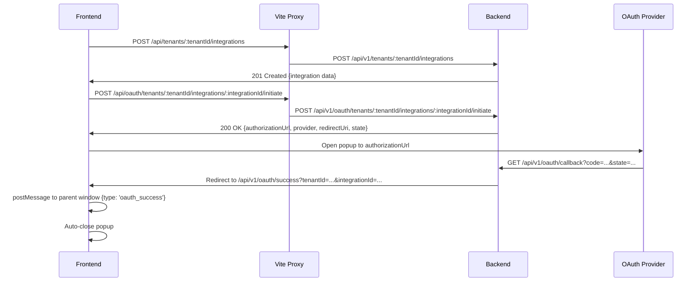

# OAuth Frontend Integration Guide

**Date**: 2025-08-03  
**Version**: 3.0  
**Target Audience**: Frontend Developers  
**Backend Server**: `https://mwapss.shibari.photo` (development/staging), `https://mwapps.shibari.photo` (production)  

## Overview

This guide provides complete instructions for implementing OAuth integrations in the MWAP frontend application. The backend OAuth system is fully implemented with PKCE (RFC 7636) support, secure domain handling, and enhanced monitoring. This update reflects the latest backend changes from PR #55.

Key updates:
- Domain correction to `mwapps.shibari.photo` for production.
- Full PKCE validation and support.
- New success/error endpoints with auto-close popup functionality and postMessage communication.
- Environment-aware configurations for development, staging, and production.

## Architecture Overview

### Frontend-Backend Communication

The frontend uses a Vite proxy configuration that handles API path rewriting:

```javascript
// vite.config.js
export default {
  server: {
    proxy: {
      '/api': {
        target: 'https://mwapss.shibari.photo/api/v1',  // Use appropriate backend domain
        changeOrigin: true,
        secure: true,
        rewrite: (path) => path.replace(/^\/api\//, ''),
      },
    },
  },
}
```

**Environment-Specific Targets**:
- Development: `http://localhost:3001/api/v1` or `https://mwapss.shibari.photo/api/v1`
- Staging: `https://mwapss.shibari.photo/api/v1`
- Production: `https://mwapps.shibari.photo/api/v1`

### OAuth Flow Architecture

The flow now supports popups with postMessage for seamless integration.



For errors, redirect to `/api/v1/oauth/error` with postMessage `{type: 'oauth_error'}`.

## Step-by-Step Implementation

### Step 1: Generate PKCE Parameters

Use the provided functions:

```javascript
// From guide
// Generate code_verifier
function generateCodeVerifier() {
  const array = new Uint8Array(32);
  crypto.getRandomValues(array);
  return btoa(String.fromCharCode.apply(null, array))
    .replace(/\+/g, '-')
    .replace(/\//g, '_')
    .replace(/=/g, '');
}

// Generate code_challenge
async function generateCodeChallenge(codeVerifier) {
  const encoder = new TextEncoder();
  const data = encoder.encode(codeVerifier);
  const digest = await crypto.subtle.digest('SHA-256', data);
  return btoa(String.fromCharCode.apply(null, new Uint8Array(digest)))
    .replace(/\+/g, '-')
    .replace(/\//g, '_')
    .replace(/=/g, '');
}
```

### Step 2: Store PKCE in Integration Metadata

PATCH /api/tenants/{tenantId}/integrations/{integrationId} with pkceMetadata.

### Step 3: Create Integration

First, create an integration record for the OAuth provider:

```typescript
// Integration creation
const createIntegration = async (tenantId: string, providerId: string) => {
  try {
    const response = await fetch(`/api/tenants/${tenantId}/integrations`, {
      method: 'POST',
      headers: {
        'Authorization': `Bearer ${jwtToken}`,
        'Content-Type': 'application/json'
      },
      body: JSON.stringify({
        providerId,
        metadata: {
          displayName: `${providerName} Integration`,
          description: `Integration with ${providerName}`,
          settings: {
            autoRefresh: true,
            notifyOnExpiration: true
          }
        }
      })
    });

    if (!response.ok) {
      throw new Error(`HTTP ${response.status}: ${response.statusText}`);
    }

    const result = await response.json();
    
    // Expected response format:
    // {
    //   success: true,
    //   data: {
    //     _id: "integration-id",
    //     tenantId: "tenant-id",
    //     providerId: "provider-id",
    //     status: "active",
    //     createdAt: "2025-01-08T...",
    //     updatedAt: "2025-01-08T...",
    //     createdBy: "user-id",
    //     metadata: { ... }
    //   }
    // }
    
    return result.data;
  } catch (error) {
    console.error('Integration creation failed:', error);
    throw error;
  }
};
```

### Step 4: Initiate OAuth Flow

Use the backend initiation endpoint. The backend now handles PKCE validation.

```typescript
// OAuth flow initiation
const initiateOAuthFlow = async (tenantId: string, integrationId: string) => {
  try {
    const response = await fetch(`/api/oauth/tenants/${tenantId}/integrations/${integrationId}/initiate`, {
      method: 'POST',
      headers: {
        'Authorization': `Bearer ${jwtToken}`,
        'Content-Type': 'application/json'
      }
    });

    if (!response.ok) {
      throw new Error(`HTTP ${response.status}: ${response.statusText}`);
    }

    const result = await response.json();
    
    // Expected response format:
    // {
    //   success: true,
    //   data: {
    //     authorizationUrl: "https://www.dropbox.com/oauth2/authorize?...",
    //     provider: {
    //       name: "dropbox",
    //       displayName: "Dropbox"
    //     },
    //     redirectUri: "https://mwapss.shibari.com/api/v1/oauth/callback",
    //     state: "base64-encoded-state-parameter"
    //   }
    // }
    
    return result.data;
  } catch (error) {
    console.error('OAuth initiation failed:', error);
    throw error;
  }
};
```

### Step 5: Redirect to OAuth Provider (Popup Support)

Update the OAuthButton to use popups and listen for postMessage:

```typescript
// Complete OAuth button implementation with popup
const handleOAuthClick = async () => {
  // ... create integration and initiate as before
  
  const popup = window.open(oauthData.authorizationUrl, 'oauthPopup', 'width=600,height=600');

  window.addEventListener('message', (event) => {
    if (event.origin !== window.location.origin) return;
    if (event.data.type === 'oauth_success') {
      // Handle success
      queryClient.invalidateQueries(['integrations']);
      showSuccessNotification('Integration connected!');
      popup?.close();
    } else if (event.data.type === 'oauth_error') {
      // Handle error
      showErrorNotification(event.data.description || 'OAuth failed');
      popup?.close();
    }
  });
};
```

### Step 6: Handle OAuth Callback

The backend redirects to `/api/v1/oauth/success` or `/api/v1/oauth/error`, which are now full pages that auto-close and send postMessage.

In OAuthCallbackPage.tsx (now potentially loaded in popup):

Add:

```typescript
useEffect(() => {
  if (window.opener) {
    window.opener.postMessage({ type: 'oauth_success', integrationId }, window.location.origin);
    setTimeout(() => window.close(), 3000);
  }
}, []);
```

Similar for error.

### Step 7: Add Route Configuration

Add routes for /oauth/success and /oauth/error if not already.

```typescript
// App router configuration
import { createBrowserRouter } from 'react-router-dom';
import OAuthCallbackPage from './components/OAuthCallbackPage';

const router = createBrowserRouter([
  // ... other routes
  {
    path: '/oauth/success',
    element: <OAuthCallbackPage />
  },
  {
    path: '/oauth/error', 
    element: <OAuthCallbackPage />
  }
]);
```

## React Query Integration

### Integration Queries

```typescript
// React Query hooks for integrations
import { useQuery, useMutation, useQueryClient } from '@tanstack/react-query';

// Fetch integrations
export const useIntegrations = (tenantId: string) => {
  return useQuery({
    queryKey: ['integrations', tenantId],
    queryFn: async () => {
      const response = await fetch(`/api/tenants/${tenantId}/integrations`, {
        headers: {
          'Authorization': `Bearer ${getJwtToken()}`
        }
      });
      
      if (!response.ok) {
        throw new Error('Failed to fetch integrations');
      }
      
      const result = await response.json();
      return result.data;
    }
  });
};

// Create integration mutation
export const useCreateIntegration = () => {
  const queryClient = useQueryClient();
  
  return useMutation({
    mutationFn: async ({ tenantId, providerId, metadata }) => {
      const response = await fetch(`/api/tenants/${tenantId}/integrations`, {
        method: 'POST',
        headers: {
          'Authorization': `Bearer ${getJwtToken()}`,
          'Content-Type': 'application/json'
        },
        body: JSON.stringify({ providerId, metadata })
      });
      
      if (!response.ok) {
        throw new Error('Failed to create integration');
      }
      
      const result = await response.json();
      return result.data;
    },
    onSuccess: (data, variables) => {
      // Invalidate and refetch integrations
      queryClient.invalidateQueries(['integrations', variables.tenantId]);
    }
  });
};

// OAuth initiation mutation
export const useInitiateOAuth = () => {
  return useMutation({
    mutationFn: async ({ tenantId, integrationId }) => {
      const response = await fetch(`/api/oauth/tenants/${tenantId}/integrations/${integrationId}/initiate`, {
        method: 'POST',
        headers: {
          'Authorization': `Bearer ${getJwtToken()}`,
          'Content-Type': 'application/json'
        }
      });
      
      if (!response.ok) {
        throw new Error('Failed to initiate OAuth flow');
      }
      
      const result = await response.json();
      return result.data;
    }
  });
};
```

## Error Handling

### Comprehensive Error Handling

```typescript
// Error handling utilities
export class OAuthError extends Error {
  constructor(message: string, public code?: string, public details?: any) {
    super(message);
    this.name = 'OAuthError';
  }
}

// Enhanced OAuth button with error handling
const EnhancedOAuthButton = ({ tenantId, providerId, providerName }) => {
  const [isLoading, setIsLoading] = useState(false);
  const [error, setError] = useState<string | null>(null);
  
  const createIntegration = useCreateIntegration();
  const initiateOAuth = useInitiateOAuth();

  const handleOAuthClick = async () => {
    setIsLoading(true);
    setError(null);
    
    try {
      // Create integration
      const integration = await createIntegration.mutateAsync({
        tenantId,
        providerId,
        metadata: {
          displayName: `${providerName} Integration`,
          description: `Integration with ${providerName}`
        }
      });
      
      // Initiate OAuth flow
      const oauthData = await initiateOAuth.mutateAsync({
        tenantId,
        integrationId: integration._id
      });
      
      // Redirect to OAuth provider
      window.location.href = oauthData.authorizationUrl;
      
    } catch (err) {
      console.error('OAuth flow failed:', err);
      
      let errorMessage = 'Failed to connect to provider. Please try again.';
      
      if (err instanceof Error) {
        if (err.message.includes('404')) {
          errorMessage = 'Service temporarily unavailable. Please try again later.';
        } else if (err.message.includes('401')) {
          errorMessage = 'Authentication failed. Please log in again.';
        } else if (err.message.includes('403')) {
          errorMessage = 'You do not have permission to create integrations.';
        }
      }
      
      setError(errorMessage);
      setIsLoading(false);
    }
  };

  return (
    <div className="oauth-button-container">
      <button 
        onClick={handleOAuthClick} 
        disabled={isLoading}
        className={`oauth-button ${error ? 'error' : ''}`}
      >
        {isLoading ? 'Connecting...' : `Connect ${providerName}`}
      </button>
      
      {error && (
        <div className="error-message">
          {error}
        </div>
      )}
    </div>
  );
};
```

## Testing

### Unit Tests

```typescript
// OAuth button tests
import { render, screen, fireEvent, waitFor } from '@testing-library/react';
import { QueryClient, QueryClientProvider } from '@tanstack/react-query';
import OAuthButton from './OAuthButton';

// Mock fetch
global.fetch = jest.fn();

describe('OAuthButton', () => {
  let queryClient: QueryClient;

  beforeEach(() => {
    queryClient = new QueryClient({
      defaultOptions: {
        queries: { retry: false },
        mutations: { retry: false }
      }
    });
    
    (fetch as jest.Mock).mockClear();
  });

  it('should create integration and initiate OAuth flow', async () => {
    // Mock successful responses
    (fetch as jest.Mock)
      .mockResolvedValueOnce({
        ok: true,
        json: () => Promise.resolve({
          success: true,
          data: { _id: 'integration-123', tenantId: 'tenant-123' }
        })
      })
      .mockResolvedValueOnce({
        ok: true,
        json: () => Promise.resolve({
          success: true,
          data: { authorizationUrl: 'https://provider.com/oauth' }
        })
      });

    // Mock window.location.href
    delete window.location;
    window.location = { href: '' } as any;

    render(
      <QueryClientProvider client={queryClient}>
        <OAuthButton 
          tenantId="tenant-123" 
          providerId="provider-123" 
          providerName="Test Provider" 
        />
      </QueryClientProvider>
    );

    const button = screen.getByText('Connect Test Provider');
    fireEvent.click(button);

    await waitFor(() => {
      expect(window.location.href).toBe('https://provider.com/oauth');
    });

    expect(fetch).toHaveBeenCalledTimes(2);
  });

  it('should handle errors gracefully', async () => {
    // Mock error response
    (fetch as jest.Mock).mockRejectedValueOnce(new Error('Network error'));

    render(
      <QueryClientProvider client={queryClient}>
        <OAuthButton 
          tenantId="tenant-123" 
          providerId="provider-123" 
          providerName="Test Provider" 
        />
      </QueryClientProvider>
    );

    const button = screen.getByText('Connect Test Provider');
    fireEvent.click(button);

    await waitFor(() => {
      expect(screen.getByText(/Failed to connect/)).toBeInTheDocument();
    });
  });
});
```

### Integration Tests

```typescript
// End-to-end OAuth flow test
describe('OAuth Integration Flow', () => {
  it('should complete full OAuth flow', async () => {
    // 1. Test integration creation
    const createResponse = await fetch('/api/tenants/test-tenant/integrations', {
      method: 'POST',
      headers: {
        'Authorization': 'Bearer test-token',
        'Content-Type': 'application/json'
      },
      body: JSON.stringify({
        providerId: 'test-provider',
        metadata: { displayName: 'Test Integration' }
      })
    });
    
    expect(createResponse.ok).toBe(true);
    const integration = await createResponse.json();
    expect(integration.success).toBe(true);
    
    // 2. Test OAuth initiation
    const initiateResponse = await fetch(`/api/oauth/tenants/test-tenant/integrations/${integration.data._id}/initiate`, {
      method: 'POST',
      headers: {
        'Authorization': 'Bearer test-token',
        'Content-Type': 'application/json'
      }
    });
    
    expect(initiateResponse.ok).toBe(true);
    const oauthData = await initiateResponse.json();
    expect(oauthData.success).toBe(true);
    expect(oauthData.data.authorizationUrl).toBeDefined();
  });
});
```

## Security Considerations

### JWT Token Management

```typescript
// Secure JWT token handling
const getJwtToken = (): string => {
  const token = localStorage.getItem('jwt_token') || sessionStorage.getItem('jwt_token');
  
  if (!token) {
    throw new Error('No authentication token found');
  }
  
  // Validate token expiration
  try {
    const payload = JSON.parse(atob(token.split('.')[1]));
    if (payload.exp * 1000 < Date.now()) {
      throw new Error('Token expired');
    }
  } catch (error) {
    throw new Error('Invalid token format');
  }
  
  return token;
};

// Automatic token refresh
const useAuthToken = () => {
  const [token, setToken] = useState<string | null>(null);
  
  useEffect(() => {
    const refreshToken = async () => {
      try {
        const newToken = await refreshAuthToken();
        setToken(newToken);
      } catch (error) {
        // Redirect to login
        window.location.href = '/login';
      }
    };
    
    // Check token expiration every 5 minutes
    const interval = setInterval(refreshToken, 5 * 60 * 1000);
    return () => clearInterval(interval);
  }, []);
  
  return token;
};
```

### CSRF Protection

The backend handles CSRF protection through state parameter validation. Frontend should:

1. **Never manipulate state parameters** - always use backend-generated state
2. **Validate callback parameters** - ensure tenantId and integrationId are expected
3. **Handle callback errors** - display appropriate error messages for security failures

## Troubleshooting

### Common Issues

1. **404 Errors on API Calls**
   - **Cause**: Vite proxy not configured correctly
   - **Solution**: Verify proxy configuration in `vite.config.js`

2. **OAuth Callback Not Working**
   - **Cause**: OAuth provider redirect URI mismatch
   - **Solution**: Verify provider configuration uses `https://mwapss.shibari.com/api/v1/oauth/callback`

3. **Authentication Errors**
   - **Cause**: JWT token expired or invalid
   - **Solution**: Implement token refresh or redirect to login

4. **Integration Not Updating**
   - **Cause**: React Query cache not invalidated
   - **Solution**: Ensure `queryClient.invalidateQueries()` is called after OAuth success

### Debug Mode

```typescript
// Enable debug logging
const DEBUG_OAUTH = process.env.NODE_ENV === 'development';

const debugLog = (message: string, data?: any) => {
  if (DEBUG_OAUTH) {
    console.log(`[OAuth Debug] ${message}`, data);
  }
};

// Use in OAuth operations
const initiateOAuthFlow = async (tenantId: string, integrationId: string) => {
  debugLog('Initiating OAuth flow', { tenantId, integrationId });
  
  try {
    const response = await fetch(`/api/oauth/tenants/${tenantId}/integrations/${integrationId}/initiate`, {
      method: 'POST',
      headers: {
        'Authorization': `Bearer ${jwtToken}`,
        'Content-Type': 'application/json'
      }
    });
    
    debugLog('OAuth initiation response', { 
      status: response.status, 
      ok: response.ok 
    });
    
    const result = await response.json();
    debugLog('OAuth initiation data', result);
    
    return result.data;
  } catch (error) {
    debugLog('OAuth initiation error', error);
    throw error;
  }
};
```

## Handling Existing Integrations

The backend enforces one integration per tenant/provider. Check for existing before creating, and update for re-auth if needed (e.g., expired tokens).

## Summary

This guide provides everything needed to implement OAuth integrations in the MWAP frontend:

1. **Backend Integration**: Use Vite proxy for seamless API communication
2. **OAuth Flow**: Create integration → Initiate OAuth → Handle callback
3. **Error Handling**: Comprehensive error handling with user-friendly messages
4. **React Query**: Proper cache management and data synchronization
5. **Security**: JWT token management and CSRF protection
6. **Testing**: Unit and integration test patterns

The backend OAuth implementation is complete and secure. Follow this guide to implement the frontend components correctly.

## Next Steps

1. Implement the `OAuthButton` component
2. Create the `OAuthCallbackPage` component  
3. Add React Query hooks for integration management
4. Configure routing for OAuth callback handling
5. Test the complete OAuth flow with each provider
6. Implement error handling and user feedback
7. Add monitoring and analytics for OAuth operations

For questions or issues, refer to the troubleshooting section or consult the backend OAuth security documentation.