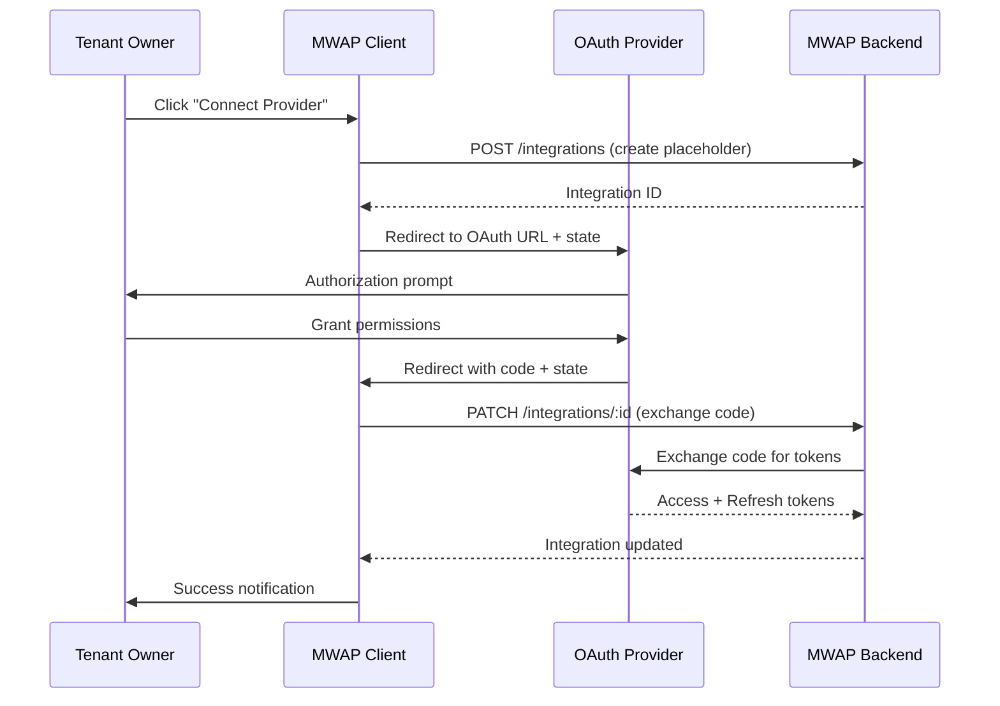

# 🚀 Plan: Clean Cloud Provider Integration Feature

## Goal Summary

### What is being built
A standalone, clean cloud provider integration feature that allows tenant owners to connect pre-configured cloud providers to their tenant using OAuth functionality with secure token management.

### Why
- **Clean Architecture**: Extract cloud provider integration from tenant management for better separation of concerns
- **Scalability**: Create a reusable integration system that can be extended to other contexts (projects, users)
- **User Experience**: Provide a dedicated, intuitive interface for managing cloud provider connections
- **Maintainability**: Reduce code duplication and improve feature boundaries

### For whom
- **Primary Users**: Tenant Owners who need to connect cloud storage providers to their organization
- **Secondary Users**: Project Members who will benefit from seamless file access through integrations
- **Administrators**: SuperAdmins who manage the available cloud provider configurations

## 🏗 Technical Approach & Architecture Notes

### Major Components

#### 1. Integration Management System
```typescript
// Core integration management
src/features/integrations/
├── hooks/
│   ├── useIntegrations.ts          # CRUD operations for integrations
│   ├── useOAuthFlow.ts             # OAuth flow management
│   ├── useTokenManagement.ts       # Token refresh and validation
│   └── index.ts
├── pages/
│   ├── IntegrationListPage.tsx     # Main integration dashboard
│   ├── IntegrationCreatePage.tsx   # Integration setup wizard
│   ├── IntegrationDetailsPage.tsx  # Individual integration management
│   └── index.ts
├── components/
│   ├── IntegrationCard.tsx         # Integration status display
│   ├── OAuthButton.tsx             # OAuth initiation component
│   ├── TokenStatusBadge.tsx        # Token health indicator
│   ├── ProviderSelector.tsx        # Cloud provider selection
│   └── IntegrationWizard.tsx       # Step-by-step setup
├── types/
│   ├── integration.types.ts        # Integration-specific types
│   ├── oauth.types.ts              # OAuth flow types
│   └── index.ts
└── index.ts
```

#### 2. OAuth Flow Architecture


#### 3. Data Flow Architecture
```typescript
// Integration data flow
interface IntegrationDataFlow {
  // 1. Provider Selection
  availableProviders: CloudProvider[] // From cloud-providers feature
  
  // 2. Integration Creation
  integrationRequest: IntegrationCreateRequest
  
  // 3. OAuth Flow
  oauthState: OAuthState
  authorizationUrl: string
  
  // 4. Token Management
  tokens: EncryptedTokens
  tokenStatus: TokenStatus
  
  // 5. Integration Usage
  activeIntegrations: Integration[]
  integrationHealth: IntegrationHealth[]
}
```

### Technologies & Patterns

#### State Management
- **React Query**: Server state management with automatic caching
- **Context API**: OAuth flow state management
- **Local State**: Component-level UI state with useState/useReducer

#### Authentication & Authorization
- **Auth0 Integration**: Leverage existing authentication system
- **RBAC**: Tenant Owner role required for integration management
- **Token Security**: Memory-based storage, automatic refresh

#### API Integration
- **RESTful Endpoints**: Following existing API patterns
- **Type Safety**: Zod validation for all API requests/responses
- **Error Handling**: Consistent error patterns with user-friendly messages

## 🔒 Security Considerations

### OAuth Security
```typescript
// Secure OAuth state management
interface OAuthState {
  integrationId: string;
  tenantId: string;
  nonce: string;           // CSRF protection
  codeVerifier: string;    // PKCE implementation
  timestamp: number;       // State expiration
}

// State validation
const validateOAuthState = (state: string): OAuthState | null => {
  try {
    const decoded = JSON.parse(atob(state));
    
    // Validate timestamp (max 10 minutes)
    if (Date.now() - decoded.timestamp > 600000) {
      throw new Error('OAuth state expired');
    }
    
    // Validate required fields
    if (!decoded.integrationId || !decoded.tenantId || !decoded.nonce) {
      throw new Error('Invalid OAuth state structure');
    }
    
    return decoded;
  } catch (error) {
    console.error('OAuth state validation failed:', error);
    return null;
  }
};
```

### Token Management Security
- **Encryption**: All tokens encrypted at rest in backend
- **Memory Storage**: No token storage in localStorage/sessionStorage
- **Automatic Refresh**: Background token refresh with fallback to re-authorization
- **Scope Validation**: Verify granted scopes match requested scopes

### Access Control
```typescript
// Role-based access control
const useIntegrationAccess = () => {
  const { userRoles, currentTenant } = useAuth();
  
  return {
    canCreateIntegration: userRoles.includes('TENANT_OWNER'),
    canManageIntegration: (integration: Integration) => 
      userRoles.includes('TENANT_OWNER') && 
      integration.tenantId === currentTenant?.id,
    canViewIntegration: (integration: Integration) =>
      integration.tenantId === currentTenant?.id
  };
};
```

### Data Protection
- **Input Validation**: Zod schemas for all user inputs
- **XSS Prevention**: Proper data sanitization and CSP headers
- **CSRF Protection**: OAuth state parameter validation
- **Rate Limiting**: API rate limiting for OAuth endpoints

## 🛠 Implementation Steps

### Phase 1: Foundation Setup (Week 1)

#### 1.1 Create Feature Structure
- [ ] Create `src/features/integrations/` directory structure
- [ ] Set up TypeScript types and interfaces
- [ ] Create index files for proper exports
- [ ] Update main feature exports

#### 1.2 Define Core Types
```typescript
// src/features/integrations/types/integration.types.ts
export interface Integration {
  id: string;
  tenantId: string;
  providerId: string;
  provider?: CloudProvider;
  status: 'pending' | 'active' | 'expired' | 'error' | 'revoked';
  accessToken?: string;        // Encrypted in backend
  refreshToken?: string;       // Encrypted in backend
  tokenExpiresAt?: string;
  scopesGranted?: string[];
  connectedAt?: string;
  metadata?: Record<string, unknown>;
  createdAt: string;
  updatedAt: string;
  createdBy: string;
}

export interface IntegrationCreateRequest {
  providerId: string;
  metadata?: {
    displayName?: string;
    description?: string;
  };
}
```

#### 1.3 Create Base Hooks
```typescript
// src/features/integrations/hooks/useIntegrations.ts
export const useIntegrations = () => {
  const { currentTenant } = useAuth();
  
  return useQuery({
    queryKey: ['integrations', currentTenant?.id],
    queryFn: async () => {
      const response = await api.get(`/tenants/${currentTenant!.id}/integrations`);
      return handleApiResponse(response, true);
    },
    enabled: !!currentTenant?.id,
  });
};
```

### Phase 2: OAuth Flow Implementation (Week 2)

#### 2.1 OAuth Utilities Enhancement
```typescript
// src/features/integrations/utils/oauth.ts
export const buildOAuthUrl = (
  provider: CloudProvider,
  integration: Integration,
  redirectUri: string
): string => {
  const state = createOAuthState(integration);
  const codeVerifier = generateCodeVerifier();
  const codeChallenge = generateCodeChallenge(codeVerifier);
  
  // Store code verifier securely
  sessionStorage.setItem(`oauth_verifier_${integration.id}`, codeVerifier);
  
  const url = new URL(provider.authUrl);
  url.searchParams.append('client_id', provider.clientId);
  url.searchParams.append('redirect_uri', redirectUri);
  url.searchParams.append('response_type', 'code');
  url.searchParams.append('scope', provider.scopes.join(' '));
  url.searchParams.append('state', btoa(JSON.stringify(state)));
  url.searchParams.append('code_challenge', codeChallenge);
  url.searchParams.append('code_challenge_method', 'S256');
  
  return url.toString();
};
```

#### 2.2 OAuth Flow Hook
```typescript
// src/features/integrations/hooks/useOAuthFlow.ts
export const useOAuthFlow = () => {
  const navigate = useNavigate();
  const { currentTenant } = useAuth();
  
  const initiateOAuth = useCallback(async (providerId: string) => {
    // Create integration placeholder
    const integration = await createIntegration({
      providerId,
      status: 'pending'
    });
    
    // Build OAuth URL
    const oauthUrl = buildOAuthUrl(
      provider,
      integration,
      `${window.location.origin}/oauth/callback`
    );
    
    // Redirect to OAuth provider
    window.location.href = oauthUrl;
  }, [currentTenant]);
  
  return { initiateOAuth };
};
```

### Phase 3: UI Components Development (Week 3)

#### 3.1 Integration List Page
```typescript
// src/features/integrations/pages/IntegrationListPage.tsx
const IntegrationListPage: React.FC = () => {
  const { data: integrations, isLoading } = useIntegrations();
  const { data: providers } = useCloudProviders();
  
  return (
    <Container size="lg">
      <Group justify="space-between" mb="md">
        <div>
          <Title order={2}>Cloud Provider Integrations</Title>
          <Text c="dimmed">Connect your cloud storage providers</Text>
        </div>
        <Button 
          leftSection={<IconPlus size={16} />}
          onClick={() => navigate('/integrations/create')}
        >
          Add Integration
        </Button>
      </Group>
      
      <SimpleGrid cols={{ base: 1, md: 2, lg: 3 }} spacing="md">
        {integrations?.map(integration => (
          <IntegrationCard 
            key={integration.id} 
            integration={integration}
          />
        ))}
      </SimpleGrid>
    </Container>
  );
};
```

#### 3.2 Integration Card Component
```typescript
// src/features/integrations/components/IntegrationCard.tsx
interface IntegrationCardProps {
  integration: Integration;
  onRefreshToken?: (id: string) => void;
  onDelete?: (id: string) => void;
}

const IntegrationCard: React.FC<IntegrationCardProps> = ({
  integration,
  onRefreshToken,
  onDelete
}) => {
  return (
    <Card withBorder p="md" radius="md">
      <Group justify="space-between" mb="md">
        <Group>
          <IconCloud size={24} />
          <div>
            <Text fw={500}>{integration.provider?.name}</Text>
            <Text size="sm" c="dimmed">{integration.provider?.type}</Text>
          </div>
        </Group>
        <TokenStatusBadge integration={integration} />
      </Group>
      
      <Stack gap="xs">
        <Group justify="space-between">
          <Text size="sm">Status</Text>
          <Badge color={getStatusColor(integration.status)}>
            {integration.status}
          </Badge>
        </Group>
        
        {integration.connectedAt && (
          <Group justify="space-between">
            <Text size="sm">Connected</Text>
            <Text size="sm" c="dimmed">
              {formatDate(integration.connectedAt)}
            </Text>
          </Group>
        )}
      </Stack>
      
      <Group mt="md" gap="xs">
        <ActionIcon 
          variant="subtle" 
          onClick={() => onRefreshToken?.(integration.id)}
          disabled={!integration.refreshToken}
        >
          <IconRefresh size={16} />
        </ActionIcon>
        <ActionIcon 
          variant="subtle" 
          color="red"
          onClick={() => onDelete?.(integration.id)}
        >
          <IconTrash size={16} />
        </ActionIcon>
      </Group>
    </Card>
  );
};
```

### Phase 4: Integration Creation Wizard (Week 4)

#### 4.1 Provider Selection
```typescript
// src/features/integrations/components/ProviderSelector.tsx
const ProviderSelector: React.FC<ProviderSelectorProps> = ({
  providers,
  selectedProvider,
  onSelect
}) => {
  return (
    <SimpleGrid cols={{ base: 1, sm: 2, md: 3 }} spacing="md">
      {providers.map(provider => (
        <Card
          key={provider.id}
          withBorder
          p="md"
          radius="md"
          className={`cursor-pointer transition-colors ${
            selectedProvider?.id === provider.id 
              ? 'border-blue-500 bg-blue-50' 
              : 'hover:bg-gray-50'
          }`}
          onClick={() => onSelect(provider)}
        >
          <Stack align="center" gap="sm">
            <IconCloud size={32} />
            <Text fw={500}>{provider.name}</Text>
            <Text size="sm" c="dimmed" ta="center">
              {provider.metadata?.description || 'Cloud storage provider'}
            </Text>
          </Stack>
        </Card>
      ))}
    </SimpleGrid>
  );
};
```

#### 4.2 Integration Wizard
```typescript
// src/features/integrations/components/IntegrationWizard.tsx
const IntegrationWizard: React.FC = () => {
  const [step, setStep] = useState(0);
  const [selectedProvider, setSelectedProvider] = useState<CloudProvider | null>(null);
  const { initiateOAuth } = useOAuthFlow();
  
  const steps = [
    {
      title: 'Select Provider',
      component: <ProviderSelector 
        providers={providers} 
        selectedProvider={selectedProvider}
        onSelect={setSelectedProvider}
      />
    },
    {
      title: 'Configure Integration',
      component: <IntegrationConfig 
        provider={selectedProvider}
        onSubmit={handleConfigSubmit}
      />
    },
    {
      title: 'Authorize Access',
      component: <OAuthAuthorization 
        provider={selectedProvider}
        onAuthorize={() => initiateOAuth(selectedProvider!.id)}
      />
    }
  ];
  
  return (
    <Container size="md">
      <Stepper active={step} onStepClick={setStep} mb="xl">
        {steps.map((stepData, index) => (
          <Stepper.Step key={index} label={stepData.title}>
            {stepData.component}
          </Stepper.Step>
        ))}
      </Stepper>
    </Container>
  );
};
```

### Phase 5: Token Management & Health Monitoring (Week 5)

#### 5.1 Token Management Hook
```typescript
// src/features/integrations/hooks/useTokenManagement.ts
export const useTokenManagement = () => {
  const queryClient = useQueryClient();
  
  const refreshToken = useMutation({
    mutationFn: async (integrationId: string) => {
      const response = await api.post(`/integrations/${integrationId}/refresh-token`);
      return handleApiResponse(response, false);
    },
    onSuccess: () => {
      queryClient.invalidateQueries({ queryKey: ['integrations'] });
    }
  });
  
  const validateToken = useCallback(async (integration: Integration) => {
    if (!integration.tokenExpiresAt) return false;
    
    const expiresAt = new Date(integration.tokenExpiresAt);
    const now = new Date();
    const bufferTime = 5 * 60 * 1000; // 5 minutes buffer
    
    return expiresAt.getTime() - now.getTime() > bufferTime;
  }, []);
  
  return {
    refreshToken: refreshToken.mutate,
    isRefreshing: refreshToken.isPending,
    validateToken
  };
};
```

#### 5.2 Health Monitoring
```typescript
// src/features/integrations/hooks/useIntegrationHealth.ts
export const useIntegrationHealth = (integrations: Integration[]) => {
  return useQuery({
    queryKey: ['integration-health', integrations.map(i => i.id)],
    queryFn: async () => {
      const healthChecks = await Promise.allSettled(
        integrations.map(async (integration) => {
          try {
            const response = await api.get(`/integrations/${integration.id}/health`);
            return {
              integrationId: integration.id,
              status: 'healthy' as const,
              lastChecked: new Date().toISOString(),
              details: response.data
            };
          } catch (error) {
            return {
              integrationId: integration.id,
              status: 'unhealthy' as const,
              lastChecked: new Date().toISOString(),
              error: error instanceof Error ? error.message : 'Unknown error'
            };
          }
        })
      );
      
      return healthChecks.map(result => 
        result.status === 'fulfilled' ? result.value : result.reason
      );
    },
    enabled: integrations.length > 0,
    refetchInterval: 5 * 60 * 1000, // Check every 5 minutes
  });
};
```

### Phase 6: Routing & Navigation Updates (Week 6)

#### 6.1 New Route Structure
```typescript
// src/core/router/AppRouter.tsx - Add integration routes
<Route element={<ProtectedRoute requiredRoles={['TENANT_OWNER']} />}>
  <Route path="/integrations" element={<IntegrationListPage />} />
  <Route path="/integrations/create" element={<IntegrationCreatePage />} />
  <Route path="/integrations/:id" element={<IntegrationDetailsPage />} />
  <Route path="/integrations/:id/edit" element={<IntegrationEditPage />} />
  
  {/* Backward compatibility */}
  <Route path="/tenant/integrations" element={<Navigate to="/integrations" replace />} />
</Route>
```

#### 6.2 Navigation Updates
```typescript
// Update navigation components to include integration links
const TenantNavigation = () => {
  return (
    <NavLink
      to="/integrations"
      leftSection={<IconCloud size={16} />}
      label="Cloud Integrations"
    />
  );
};
```

### Phase 7: Migration & Cleanup (Week 7)

#### 7.1 Extract from Tenant Feature
- [ ] Remove integration-related code from `useTenants.ts`
- [ ] Delete `TenantIntegrationsPage.tsx`
- [ ] Update tenant pages to link to new integration routes
- [ ] Remove duplicate integration hooks from cloud-providers feature

#### 7.2 Update Dependencies
- [ ] Update file management hooks to use new integration structure
- [ ] Update project file access to work with new integration system
- [ ] Ensure OAuth callback continues to work with new structure

## ✅ Testing & Validation Strategy

### Unit Testing
```typescript
// src/features/integrations/hooks/__tests__/useIntegrations.test.ts
describe('useIntegrations', () => {
  it('should fetch integrations for current tenant', async () => {
    const mockTenant = { id: 'tenant-1' };
    const mockIntegrations = [{ id: 'int-1', tenantId: 'tenant-1' }];
    
    mockApi.get.mockResolvedValue({ data: { success: true, data: mockIntegrations } });
    
    const { result } = renderHook(() => useIntegrations(), {
      wrapper: createQueryWrapper()
    });
    
    await waitFor(() => {
      expect(result.current.data).toEqual(mockIntegrations);
    });
  });
});
```

### Integration Testing
```typescript
// Test OAuth flow end-to-end
describe('OAuth Integration Flow', () => {
  it('should complete OAuth flow successfully', async () => {
    // 1. Create integration
    const integration = await createIntegration({ providerId: 'provider-1' });
    
    // 2. Build OAuth URL
    const oauthUrl = buildOAuthUrl(provider, integration, redirectUri);
    expect(oauthUrl).toContain('code_challenge');
    
    // 3. Simulate OAuth callback
    const callbackUrl = `${redirectUri}?code=auth-code&state=${btoa(JSON.stringify(state))}`;
    const result = await handleOAuthCallback(callbackUrl);
    
    expect(result.success).toBe(true);
  });
});
```

### Component Testing
```typescript
// Test integration card component
describe('IntegrationCard', () => {
  it('should display integration status correctly', () => {
    const integration = {
      id: 'int-1',
      status: 'active',
      provider: { name: 'Google Drive' }
    };
    
    render(<IntegrationCard integration={integration} />);
    
    expect(screen.getByText('Google Drive')).toBeInTheDocument();
    expect(screen.getByText('active')).toBeInTheDocument();
  });
});
```

### Local Testing Strategy
1. **Development Server**: Test with `npm run dev` on local machine
2. **API Integration**: Test against local backend or staging environment
3. **OAuth Testing**: Use test OAuth providers or sandbox environments
4. **Browser Testing**: Manual testing across Chrome, Firefox, Safari
5. **Mobile Testing**: Test responsive design on mobile devices

## ⚠ Potential Risks & Mitigations

### Risk 1: OAuth Security Vulnerabilities
**Impact**: High - Could compromise user data and system security
**Mitigation**:
- Implement PKCE (Proof Key for Code Exchange) for all OAuth flows
- Use secure state parameter validation with CSRF protection
- Implement proper token storage (memory only, no localStorage)
- Regular security audits of OAuth implementation

### Risk 2: Token Management Complexity
**Impact**: Medium - Could lead to authentication failures and poor UX
**Mitigation**:
- Implement robust token refresh mechanisms with fallback strategies
- Add comprehensive error handling for token-related failures
- Provide clear user feedback for token status and issues
- Implement automatic retry logic for transient failures

### Risk 3: Breaking Changes During Migration
**Impact**: High - Could disrupt existing functionality
**Mitigation**:
- Maintain backward compatibility during transition period
- Implement feature flags for gradual rollout
- Comprehensive testing of existing integration functionality
- Rollback plan for quick reversion if issues arise

### Risk 4: Performance Impact
**Impact**: Medium - Could slow down application performance
**Mitigation**:
- Implement proper caching strategies with React Query
- Optimize API calls and reduce unnecessary requests
- Use lazy loading for integration components
- Monitor performance metrics during rollout

### Risk 5: User Experience Disruption
**Impact**: Medium - Could confuse users during transition
**Mitigation**:
- Provide clear migration communication to users
- Implement helpful onboarding for new integration interface
- Maintain familiar UI patterns and workflows
- Gather user feedback and iterate quickly

## 📌 Next Steps Checklist

### Immediate Actions (Week 1)
- [ ] **Create feature branch**: `feature/cloud-provider-integration`
- [ ] **Set up directory structure**: Create `src/features/integrations/` with all subdirectories
- [ ] **Define TypeScript types**: Create comprehensive type definitions for integrations
- [ ] **Create base hooks**: Implement `useIntegrations` with basic CRUD operations
- [ ] **Update project documentation**: Document new feature architecture

### Short-term Goals (Weeks 2-3)
- [ ] **Implement OAuth flow**: Create secure OAuth utilities and flow management
- [ ] **Build core components**: Develop IntegrationCard, ProviderSelector, and base UI
- [ ] **Create integration pages**: Build IntegrationListPage and IntegrationCreatePage
- [ ] **Add routing**: Update AppRouter with new integration routes
- [ ] **Test OAuth flow**: Ensure OAuth integration works with test providers

### Medium-term Goals (Weeks 4-5)
- [ ] **Complete integration wizard**: Build step-by-step integration setup
- [ ] **Implement token management**: Add token refresh and health monitoring
- [ ] **Add advanced features**: Integration health checks, bulk operations
- [ ] **Update navigation**: Integrate new routes into main navigation
- [ ] **Comprehensive testing**: Unit, integration, and component tests

### Long-term Goals (Weeks 6-7)
- [ ] **Migration from tenant feature**: Extract and clean up old integration code
- [ ] **Update dependencies**: Ensure file management and projects work with new structure
- [ ] **Performance optimization**: Implement caching and performance improvements
- [ ] **User documentation**: Create user guides for new integration interface
- [ ] **Production deployment**: Deploy feature with proper monitoring and rollback plan

### Success Criteria
- [ ] **Functional**: All existing integration functionality works in new feature
- [ ] **Secure**: OAuth flow passes security audit with PKCE implementation
- [ ] **Performant**: No degradation in application performance
- [ ] **Maintainable**: Clean code structure with comprehensive tests
- [ ] **User-friendly**: Intuitive interface with clear user feedback

---

**Assumptions**:
- Backend API endpoints remain unchanged during migration
- Current OAuth providers (Google Drive, Dropbox, OneDrive) continue to work
- Existing integration data can be migrated without data loss
- Auth0 authentication system remains stable
- React Query and Mantine UI libraries remain current versions

**Dependencies**:
- Backend team coordination for any API changes
- Design team input for new UI components
- Security team review of OAuth implementation
- QA team for comprehensive testing coverage