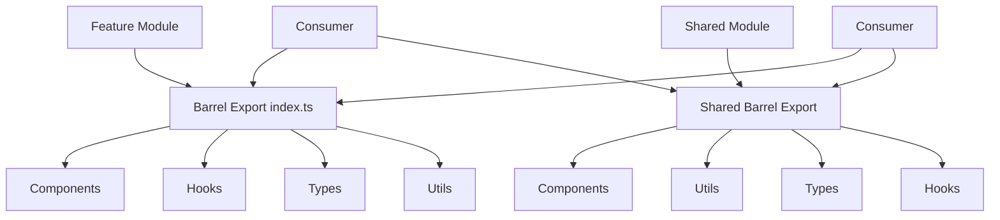

# 🚀 Plan: Export/Import Consistency Fix

## Goal Summary

**What**: Fix critical export/import inconsistencies causing runtime errors and establish consistent barrel export patterns across the MWAP client codebase.

**Why**: The current codebase has 15+ export/import issues including 4 critical runtime errors that prevent the application from running properly. These issues compromise maintainability, developer experience, and application stability.

**For Whom**: Development team and end users who need a stable, maintainable application with consistent module organization.

## 🏗 Technical Approach & Architecture Notes

### Current State Analysis
- **Feature-based architecture** with barrel exports (`index.ts` files)
- **Mixed export patterns** (default vs named exports)
- **Incomplete barrel exports** missing critical utilities and components
- **Runtime breaking imports** in integration hooks

### Target Architecture


### Export Pattern Standardization
1. **Named Exports Only**: Eliminate mixed default/named export patterns
2. **Complete Barrel Exports**: All modules exported through feature `index.ts`
3. **Consistent Import Paths**: All imports use barrel exports, not direct file imports
4. **Type Safety**: All TypeScript types properly exported and accessible

## 🔒 Security Considerations

### Data Handling
- **No sensitive data exposure**: Export fixes don't expose internal implementation details
- **Type safety maintained**: All fixes preserve existing TypeScript strict mode compliance
- **API client security**: Maintain existing authentication patterns in API client exports

### Access Control
- **Barrel export boundaries**: Maintain clear public API boundaries through barrel exports
- **Internal module protection**: Keep internal utilities private unless explicitly exported

## 🛠 Implementation Steps

### Phase 1: Critical Runtime Fixes (IMMEDIATE)
**Priority**: P0 - Blocks application startup

#### Step 1.1: Fix API Client Import Errors
**Files**: 4 integration hooks with broken `apiClient` imports
- [ ] Update `/src/features/integrations/hooks/useIntegrationHealth.ts:3`
- [ ] Update `/src/features/integrations/hooks/useBulkOperations.ts:3`
- [ ] Update `/src/features/integrations/hooks/useIntegrationTesting.ts:3`
- [ ] Update `/src/features/integrations/hooks/useIntegrationAnalytics.ts:3`

**Change Pattern**:
```typescript
// BEFORE (BROKEN)
import { apiClient } from '../../../shared/utils/api';

// AFTER (FIXED)
import api from '../../../shared/utils/api';
// Then use: api.get(), api.post(), etc.
```

#### Step 1.2: Resolve Duplicate Type Definitions
**Issue**: `ProjectRole` defined in two locations
- [ ] **Decision**: Keep `/src/features/auth/types/auth.types.ts` as source of truth
- [ ] Remove duplicate from `/src/shared/types/auth.ts`
- [ ] Update all imports to use auth feature types
- [ ] Verify no breaking changes in type usage

### Phase 2: Shared Module Completeness (HIGH)
**Priority**: P1 - Affects multiple features

#### Step 2.1: Complete Shared Utils Barrel Export
**File**: `/src/shared/utils/index.ts`

**Current**:
```typescript
export * from './api';
```

**Target**:
```typescript
// API client and utilities
export { default as api } from './api';
export { testNetworkConnectivity } from './api';

// Data transformation utilities
export { handleApiResponse, handleDeleteResponse } from './dataTransform';

// OAuth utilities
export { 
  buildOAuthUrl, 
  parseOAuthState, 
  getOAuthCallbackUri, 
  getOAuthSuccessUri, 
  getOAuthErrorUri 
} from './oauth';

// API response handler
export * from './apiResponseHandler';

// Notification utilities
export * from './notificationUtils';
```

#### Step 2.2: Complete Shared Components Barrel Export
**File**: `/src/shared/components/index.ts`

**Add Missing Exports**:
```typescript
// Add these missing exports
export { default as AuthLoadingSpinner } from './AuthLoadingSpinner';
export { default as IntegrationStatusWidget } from './IntegrationStatusWidget';
```

### Phase 3: Feature Module Completeness (MEDIUM)
**Priority**: P2 - Affects feature completeness

#### Step 3.1: Complete Integration Hooks Exports
**File**: `/src/features/integrations/hooks/index.ts`

**Add Missing Exports**:
```typescript
// Add these missing exports
export { useRevokeIntegration } from './useDeleteIntegration';
export { useRefreshIntegrationToken } from './useUpdateIntegration';
export { useBulkOperationUI } from './useBulkOperations';
export { useMultipleIntegrationHealth } from './useIntegrationHealth';
export { useTenantAnalytics } from './useIntegrationAnalytics';
```

#### Step 3.2: Fix Project Types Barrel Export
**File**: `/src/features/project-types/index.ts`

**Add Missing Type Exports**:
```typescript
// Add type exports
export type { ProjectType, ProjectTypeCreate, ProjectTypeUpdate } from './types';
```

#### Step 3.3: Fix Files Feature Export Pattern
**File**: `/src/features/files/index.ts`

**Current (Mixed Pattern)**:
```typescript
export { default as useFiles, useProjectFiles } from './hooks/useFiles';
```

**Target (Consistent Named Exports)**:
```typescript
export { useFiles, useProjectFiles } from './hooks';
```

### Phase 4: Import Standardization (LOW)
**Priority**: P3 - Affects maintainability

#### Step 4.1: Update Direct Imports to Use Barrel Exports
**Files with Direct Imports**:
- [ ] `/src/core/router/ProtectedRoute.tsx:5` - Update AuthLoadingSpinner import
- [ ] `/src/pages/Dashboard.tsx` - Update IntegrationStatusWidget import

**Pattern**:
```typescript
// BEFORE (Direct Import)
import { AuthLoadingSpinner } from '../../shared/components/AuthLoadingSpinner';

// AFTER (Barrel Import)
import { AuthLoadingSpinner } from '../../shared/components';
```

#### Step 4.2: Standardize All Import Patterns
- [ ] Audit all feature imports for consistency
- [ ] Update any remaining direct imports to use barrel exports
- [ ] Ensure consistent import ordering (external, internal, relative)

## ✅ Testing & Validation Strategy

### Local Development Testing
**Environment**: Pull repository to local machine and test locally

#### Phase 1 Validation
- [ ] **Runtime Test**: Verify application starts without import errors
- [ ] **Integration Hooks Test**: Verify all 4 integration hooks load without errors
- [ ] **Type Compilation**: Run `npm run type-check` to verify TypeScript compilation
- [ ] **Build Test**: Run `npm run build` to verify production build succeeds

#### Phase 2 Validation
- [ ] **Shared Utils Test**: Import and use utilities from barrel export
- [ ] **Component Import Test**: Verify shared components import correctly
- [ ] **Feature Integration Test**: Test cross-feature imports work properly

#### Phase 3 Validation
- [ ] **Hook Export Test**: Verify all integration hooks are accessible
- [ ] **Type Export Test**: Verify project types are accessible from barrel export
- [ ] **Files Feature Test**: Verify files hooks work with new export pattern

#### Phase 4 Validation
- [ ] **Import Consistency Test**: Verify all imports use barrel exports
- [ ] **No Direct Imports**: Grep search to ensure no direct imports remain
- [ ] **Performance Test**: Verify no performance regression from import changes

### Automated Validation
```bash
# TypeScript compilation check
npm run type-check

# Build verification
npm run build

# Import pattern validation
grep -r "import.*\.\./\.\./.*/" src/ --include="*.ts" --include="*.tsx"

# Export completeness check
find src/features -name "index.ts" | xargs grep -L "export"
```

## ⚠ Potential Risks & Mitigations

### Risk 1: Breaking Changes in API Client Usage
**Impact**: High - Could break existing functionality
**Mitigation**: 
- Systematic search and replace of all `apiClient` usage
- Test each affected hook individually
- Maintain backward compatibility where possible

### Risk 2: Circular Import Dependencies
**Impact**: Medium - Could cause build failures
**Mitigation**:
- Careful dependency analysis before changes
- Use TypeScript compiler to detect circular imports
- Implement changes incrementally with testing

### Risk 3: Type Import Conflicts
**Impact**: Medium - Could cause TypeScript errors
**Mitigation**:
- Clear type ownership (auth types in auth feature)
- Systematic update of all type imports
- Use TypeScript strict mode to catch issues early

### Risk 4: Performance Impact from Barrel Exports
**Impact**: Low - Could affect bundle size
**Mitigation**:
- Monitor bundle size during implementation
- Use tree-shaking friendly export patterns
- Consider code splitting if needed

### Risk 5: Developer Workflow Disruption
**Impact**: Low - Could confuse developers during transition
**Mitigation**:
- Clear documentation of new import patterns
- Incremental rollout with clear communication
- Update development guidelines

## 📌 Next Steps Checklist

### Immediate Actions (Today)
- [ ] **Create feature branch**: `fix/export-import-consistency`
- [ ] **Phase 1 Implementation**: Fix 4 critical API client import errors
- [ ] **Local Testing**: Verify application starts successfully
- [ ] **Commit Phase 1**: Create focused commit for critical fixes

### Short Term (This Week)
- [ ] **Phase 2 Implementation**: Complete shared module barrel exports
- [ ] **Update Documentation**: Update import patterns in development guidelines
- [ ] **Phase 3 Implementation**: Complete feature module exports
- [ ] **Integration Testing**: Test all features work with new exports

### Medium Term (Next Week)
- [ ] **Phase 4 Implementation**: Standardize all import patterns
- [ ] **Comprehensive Testing**: Full application testing with new patterns
- [ ] **Code Review**: Peer review of all changes
- [ ] **Documentation Update**: Update component structure documentation

### Long Term (Ongoing)
- [ ] **Monitoring**: Monitor for any regression issues
- [ ] **Developer Guidelines**: Update coding standards with new patterns
- [ ] **Automation**: Add linting rules to prevent future inconsistencies
- [ ] **Knowledge Transfer**: Share learnings with development team

## 🔄 Implementation Workflow

### Branch Strategy
```bash
# Create feature branch
git checkout -b fix/export-import-consistency

# Phase-based commits
git commit -m "fix: resolve critical API client import errors (Phase 1)"
git commit -m "feat: complete shared module barrel exports (Phase 2)"
git commit -m "feat: complete feature module exports (Phase 3)"
git commit -m "refactor: standardize import patterns (Phase 4)"
```

### Pull Request Strategy
- **Single PR**: All phases in one comprehensive PR
- **Clear Description**: Link to GitHub issue #36
- **Testing Evidence**: Include before/after screenshots of successful builds
- **Review Checklist**: Provide checklist for reviewers

### Rollback Plan
- **Git Revert**: Each phase is a separate commit for easy rollback
- **Feature Flag**: Not applicable for this type of change
- **Backup Strategy**: Keep original branch until changes are verified stable

## 📋 Success Criteria

### Technical Success
- [ ] All 15+ identified issues resolved
- [ ] Zero runtime import errors
- [ ] TypeScript compilation passes
- [ ] Production build succeeds
- [ ] All features functional

### Quality Success
- [ ] Consistent export patterns across all features
- [ ] Complete barrel export coverage
- [ ] No direct imports bypassing barrel exports
- [ ] Improved developer experience

### Maintainability Success
- [ ] Clear module boundaries
- [ ] Predictable import patterns
- [ ] Reduced cognitive load for developers
- [ ] Future-proof architecture

---

**Estimated Effort**: 2-3 days
**Risk Level**: Medium (due to scope, but low individual risk)
**Dependencies**: None (self-contained changes)
**Review Requirements**: Senior developer review + TypeScript compilation verification